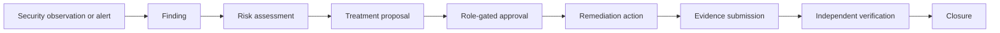
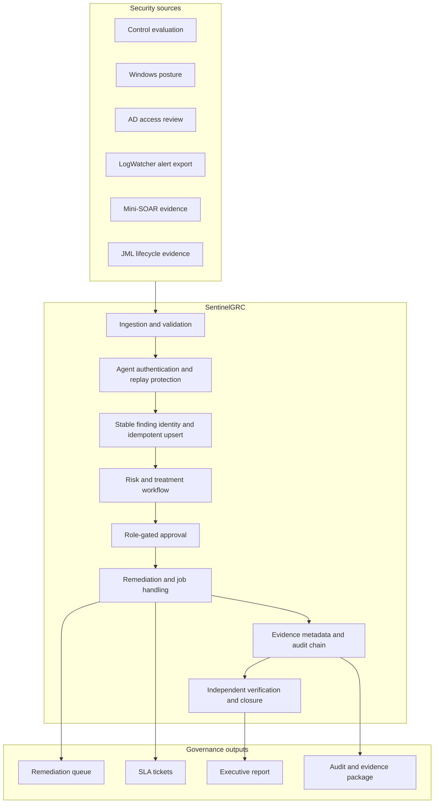
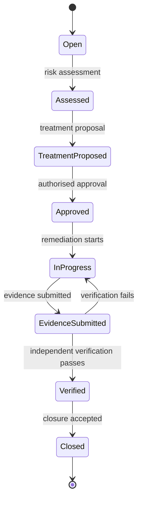
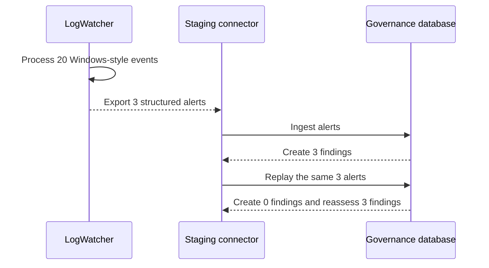
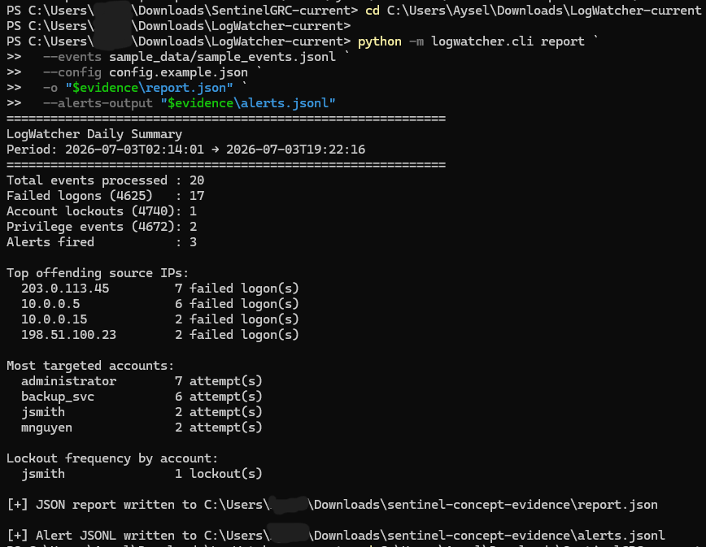
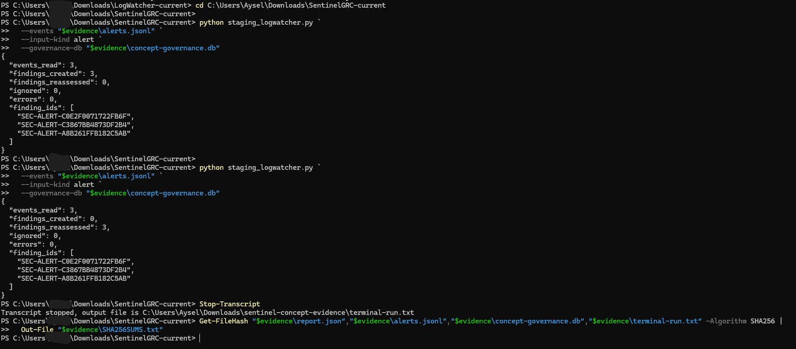
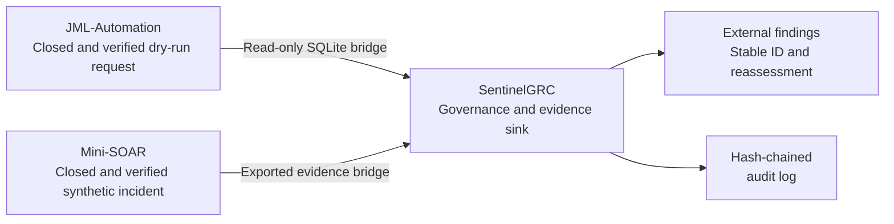
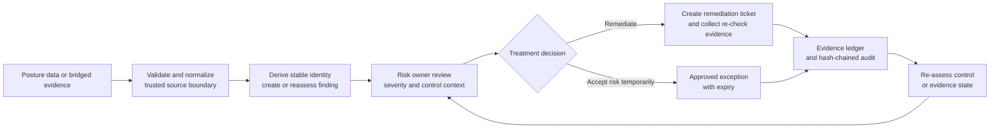

# SentinelGRC

**Continuous security governance for Windows enterprise environments.**

SentinelGRC turns endpoint security checks into an auditable governance loop:

1. Define a security control and its owner.
2. Collect endpoint posture evidence.
3. Evaluate compliance and business risk.
4. Preserve tamper-evident evidence records.
5. Produce a remediation queue and an executive-ready summary.

This is a portfolio lab aligned to governance concepts. It does not claim ISO certification or replace an organisation's ISMS.

## Phase 1-5

The platform covers endpoint control evaluation, asset-aware risk, read-only Windows posture collection, HMAC-authenticated ingestion, AD access review, and SLA-based remediation tickets.

## Governance workflow

SentinelGRC turns a security observation into a controlled, auditable lifecycle:



### End-to-end architecture



### Governance lifecycle state machine



The server derives the authenticated actor. Risk owners cannot approve their own findings, and implementers or evidence submitters cannot verify their own work.

## Phase 6: persistent state and per-agent key lifecycle

state_store.py adds SQLite-backed state for replay nonces and accepted payload hashes. The ingestion API returns the same evidence ID when the same payload is submitted again. Runtime databases and evidence are ignored by Git.

agent_keys.py stores only key metadata and lifecycle status. Secret material is returned once at registration and must be placed in a secret manager or protected environment configuration.

Register a key:

```bash
python -m scripts.agent_keys --db sentinelgrc-state.db register --agent-id WS-001 --key-id ws-001-v1
```

Start ingestion with a JSON map of active key IDs to secrets:

```powershell
$env:SENTINELGRC_AGENT_KEYS_JSON = '{"ws-001-v1":"load-this-from-a-secret-manager"}'
python -m scripts.ingestion_api serve --state-db .\runtime\sentinelgrc-state.db
```

Send from the matching agent:

```powershell
$env:SENTINELGRC_AGENT_KEY_ID = "ws-001-v1"
$env:SENTINELGRC_AGENT_SECRET = "load-this-from-a-secret-manager"
python -m scripts.posture_client .\posture.json
```

Revoke a key immediately:

```bash
python -m scripts.agent_keys --db sentinelgrc-state.db revoke --key-id ws-001-v1
```

The API rejects unknown or revoked key IDs. For multi-instance deployment, replace SQLite with a shared transactional store and put the service behind TLS/mTLS.

## Phase 7: end-to-end orchestration

`pipeline.py` connects the controls, governance, evidence, and remediation modules into one repeatable run:

```text
posture + AD review
        ?
control evaluation + asset-aware risk
        ?
hash-chained evidence ledger
        ?
remediation queue + SLA tickets
        ?
executive report
```

Run the complete pipeline:

```bash
python -m scripts.pipeline run --posture sample_posture.json --controls controls.json --assets assets.json --access-review sample_ad_access_review.json --ledger runtime/evidence-ledger.jsonl --remediation runtime/remediation-queue.json --tickets runtime/tickets.json --report runtime/executive-report.json --state-db runtime/sentinelgrc-state.db
```

The pipeline stores a run fingerprint in SQLite. Reprocessing the same posture, controls, assets, and access review returns `duplicate` and does not append another ledger record.

## Phase 7.2: automatic inbox worker

`ingestion_api.py` writes accepted posture evidence to `evidence-inbox`. Run the worker as a separate process to automatically execute the full governance pipeline:

```powershell
python -m scripts.pipeline_worker serve --inbox evidence-inbox --controls controls.json --assets assets.json --access-review sample_ad_access_review.json --ledger runtime/evidence-ledger.jsonl --state-db runtime/sentinelgrc-state.db --remediation-dir runtime/remediation --tickets-dir runtime/tickets --reports-dir runtime/reports --interval 30
```

The worker is deliberately decoupled from the HTTP API. Jobs are persisted in SQLite with a lease, retry counter, and dead-letter state. A failed job is retried up to `--max-attempts` and then remains visible as `dead` for operator review. This keeps ingestion responsive, supports retries, and allows multiple worker instances when the state store is migrated to a shared transactional database. The current worker is a polling lab implementation; production deployment should use a durable queue, service supervisor, TLS/mTLS, and centralized logging.

Expire accepted-risk exceptions as a scheduled governance job:

```bash
python -m scripts.governance expire --queue runtime/remediation/WS-001.json --output runtime/remediation/WS-001.json
```

Run this command from a scheduler after reviewing the output. Expired exceptions return to `open` and must generate a new remediation decision.

## Enterprise baseline

- `audit_log.py` provides a separate append-only, hash-chained operational audit trail for pipeline completion events.
- `job_queue.py` provides durable queue state, leases, retries, and dead-letter visibility.
- `pipeline.py` remains the deterministic governance engine; evidence integrity and operational audit are separate controls.
- `docs/enterprise-deployment.md` defines the production boundary, required TLS/mTLS, identity, storage, retention, logging, and recovery controls.

## Security boundaries

The service remains deliberately conservative:

- no automatic AD changes;
- no automatic endpoint remediation;
- no credentials or user files in posture evidence;
- loopback bind by default;
- strict payload size and schema validation;
- persistent replay protection;
- idempotent evidence ingestion;
- per-agent key ID and revocation;
- CI tests for authentication, replay, ledger integrity, idempotency, and SLA generation.

## Run tests

```bash
python -m unittest discover -v -p "test_*.py"
```

GitHub Actions validates the Python tests and parses both PowerShell agents on every push and pull request.

## Standards mapping

The catalogue illustrates how implementation evidence can be mapped to:

- ISO/IEC 27001:2022 and ISO/IEC 27002:2022
- NIST CSF 2.0: Govern, Identify, Protect, Detect, Respond, Recover
- ISO 22301 continuity objectives (future DR-assurance module)

## Planned modules

- SIEM alert correlation from LogWatcher and SOC-Homelab
- backup/DR assurance from Backup-dr-lab
- change approval and evidence closure

## Concept validation with LogWatcher

The repository contains a simple product-style integration demonstration using LogWatcher sample events:



### Evidence that proves it works



The LogWatcher screenshot proves that 20 sample events were processed and 3 alerts were generated.



The SentinelGRC screenshot proves that the first ingestion created 3 findings and replaying the same alerts created 0 new findings while reassessing 3 existing findings.

Expected connector output:

```text
First run:
events_read=3
findings_created=3
findings_reassessed=0
errors=0

Replay:
events_read=3
findings_created=0
findings_reassessed=3
errors=0
```

This validates alert ingestion and idempotent finding handling at concept level. It does not claim live Windows fleet, Elastic, SIEM, or enterprise production integration.

## Connected portfolio concepts

The [Mini-SOAR MVP blueprint](docs/mini-soar-mvp-blueprint.md) defines a
portfolio-only response orchestrator: detection alert -> governed finding ->
role-gated approval -> dry-run mock action -> evidence -> independent
verification. The [architecture brief](docs/mini-soar-blueprint.md) provides a
shorter design summary.
It deliberately does not apply changes to real endpoints, identities,
networks, cloud accounts, or external ticketing systems.



### SentinelGRC governance lifecycle



### Verified evidence bridge

`scripts/bridge_minisoar.py` imports one closed Mini-SOAR evidence bundle into
the local SentinelGRC finding store. The bridge is read-only against
Mini-SOAR, derives a stable `SEC-IR-*` finding ID, and reassesses that same
finding when the bundle is replayed. It accepts only `synthetic-lab` evidence
and, by default, requires a passing independent verification record.

```bash
python scripts/bridge_minisoar.py \
  --evidence-dir <mini-soar-export-directory> \
  --governance-db runtime/minisoar-bridge.db
```

Use `--allow-unverified` only to demonstrate exception handling in a lab. It
does not make an unverified response accepted governance evidence.

### JML lifecycle bridge

`scripts/bridge_jml.py` reads JML-Automation's SQLite database using
read-only `mode=ro`; it does not import JML code or modify lifecycle state.
Closed requests require a recorded `passed` verification before they can
become governance findings. Joiner, mover, and leaver requests map separately
to `SEC-IAM-004`, `SEC-IAM-005`, and `SEC-IAM-006` so their distinct identity
risks remain visible.

```bash
python scripts/bridge_jml.py \
  --jml-db <jml-automation-db> \
  --governance-db runtime/jml-bridge.db
```
