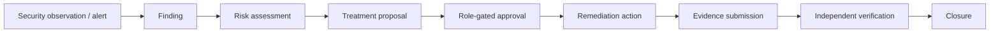
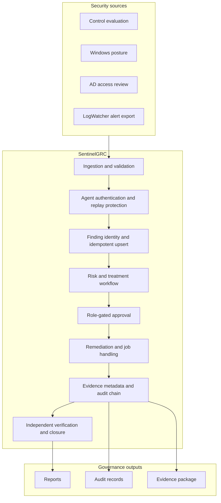
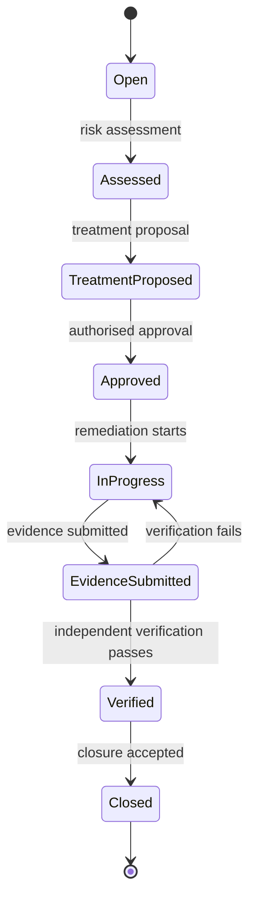

# SentinelGRC

SentinelGRC is a security governance platform concept that turns security observations and alerts into an authenticated, auditable risk-to-evidence workflow.

It is designed as a portfolio lab and Phase 1 concept validation. It does not claim ISO certification, enterprise-wide production readiness, or replacement of an organisation's ISMS.

## 1. What is SentinelGRC?

Security work is often fragmented across log tools, spreadsheets, chat approvals, ticket systems, and evidence folders. SentinelGRC provides one traceable lifecycle for a security finding:



The platform is intended to answer:

- What happened, and which asset or control is affected?
- Who owns the risk and who is allowed to approve it?
- What treatment was selected and why?
- What evidence proves that remediation occurred?
- Was verification performed by an independent actor?
- Did replaying the same event create a duplicate finding?
- Can the complete decision trail be reviewed later?

## 2. How does it work?

### End-to-end architecture



### Governance lifecycle

Each finding follows a controlled state transition. The server derives the authenticated actor; callers cannot simply choose the approver, verifier, or closer in the request body.



The workflow enforces separation of duties:

- A risk owner cannot approve the same finding.
- An implementer or evidence submitter cannot verify their own work.
- Invalid state transitions are rejected.
- Replayed input reassesses the existing finding instead of creating another open finding.

### Concept integration flow

The repository contains a simple integration demonstration using LogWatcher sample events:

```mermaid
sequenceDiagram
    participant L as LogWatcher
    participant C as Staging connector
    participant G as Governance database

    L->>L: Process 20 Windows-style events
    L-->>C: Export 3 structured alerts
    C->>G: Ingest alerts
    G-->>C: Create 3 findings
    C->>G: Replay the same 3 alerts
    G-->>C: Create 0 findings; reassess 3 findings
```

This proves alert ingestion and finding idempotency at concept level. It does not prove live Windows fleet coverage, Elastic availability, SIEM retention, or enterprise deployment.

## 3. Commands used

Run the commands from the repository root.

### Compile and run the automated test suite

```powershell
python -m compileall -q .
python -m unittest discover -q
```

### Run the SentinelGRC staging connector

Use an alert JSONL export such as the sanitized file in `docs/evidence/concept-validation/alerts.jsonl`:

```powershell
python -m scripts.staging_logwatcher `
  --events docs\evidence\concept-validation\alerts.jsonl `
  --input-kind alert `
  --governance-db runtime\concept-governance.db
```

Run the same command twice. The first run creates findings; the second run tests replay and deduplication.

### Run the governance pipeline

```powershell
python -m scripts.pipeline run `
  --posture sample_posture.json `
  --access-review sample_ad_access_review.json `
  --governance-db runtime\governance.db
```

For the complete staging procedure and additional scenarios, see:

- [Staging LogWatcher validation](docs/staging-logwatcher-validation.md)
- [Phase 1 Production MVP](docs/phase1-production-mvp.md)
- [Enterprise governance lifecycle](docs/enterprise-governance-lifecycle.md)

## 4. Evidence that proves it works

The sanitized concept evidence is stored in [docs/evidence/concept-validation/](docs/evidence/concept-validation/).

| Evidence | What it demonstrates |
|---|---|
| `report.json` | LogWatcher processed 20 sample events |
| `alerts.jsonl` | Three structured alerts were exported |
| `01-logwatcher-report.png` | LogWatcher terminal result |
| `02-sentinel-replay.png` | First ingestion and replay results |
| `SHA256SUMS.txt` | Checksums for the evidence files |
| `python -m unittest discover -q` | 85 automated tests passed locally |
| GitHub Actions | CI compilation and test validation |

Expected connector results:

```text
First run:
events_read=3
findings_created=3
findings_reassessed=0
errors=0

Replay:
events_read=3
findings_created=0
findings_reassessed=3
errors=0
```

These results demonstrate that:

1. The connector reads structured alerts.
2. SentinelGRC creates governance findings.
3. Replaying the same alerts does not create duplicates.
4. Existing findings are reassessed instead.

The repository's test suite also covers authentication, replay protection, idempotent ingestion, workflow transitions, role checks, evidence metadata, audit integrity, migration, and safety constraints.

## 5. What problems does it solve?

### Fragmented security operations

It connects alerts, assets, controls, risks, actions, evidence, and closure in one traceable workflow.

### Duplicate findings from retries or replay

Stable finding identity and idempotent upsert turn repeated input into reassessment instead of duplicate open findings.

### Untrusted approval and closure actors

Authenticated server-side actor context prevents callers from selecting privileged actors by supplying arbitrary values in the request body.

### Lack of separation of duties

Role and ownership rules prevent risk owners from approving their own findings and prevent implementers from verifying their own remediation.

### Evidence and audit scattered across files

Relational governance records, evidence metadata, checksums, and audit-chain events provide a connected history for review.

## Current scope and production boundary

Current scope:

- Security control and posture evaluation
- Asset-aware risk scoring
- Windows posture and AD access-review contracts
- HMAC agent authentication and replay protection
- Idempotent ingestion and stable finding identity
- Relational governance workflow on SQLite for lab use
- Role-gated approval and separation of duties
- Evidence metadata and audit-chain records
- Retry and dead-letter job handling
- LogWatcher alert-level concept integration
- Executive reporting and sanitized evidence

A real production deployment would still require:

- PostgreSQL or another shared transactional database
- OIDC/SSO, MFA, and short-lived tokens
- Encrypted object storage and immutable/WORM archive
- Durable queues and a managed secret store
- TLS/WAF, rate limiting, monitoring, and tracing
- Backup/restore testing and disaster recovery
- Live connectors for Windows fleets, Elastic/SIEM, and ITSM
- Independent security assessment and operational runbooks

## Repository layout

```text
scripts/      CLI entrypoints and operational runners
docs/         Architecture, deployment, validation, and evidence documentation
runtime/      Local runtime state; ignored by Git
ui/           Governance UI shell
test_*.py     Automated tests kept at repository root for unittest discovery
```

Core modules remain at the repository root for Phase 1 import compatibility. Operational entrypoints use `python -m scripts.<name>`.

## Status

SentinelGRC Phase 1 implements an authenticated, relational, risk-to-evidence governance workflow for security findings, with a validated LogWatcher concept integration.

It is a working security governance lab with test evidence—not a claim that enterprise production infrastructure has already been deployed.
