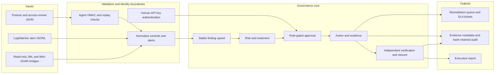
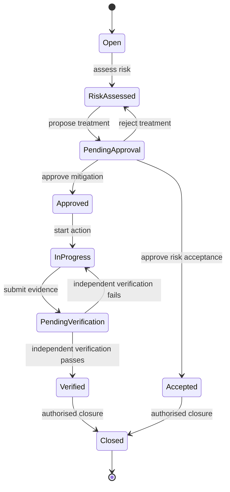
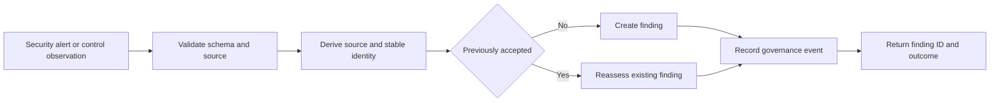
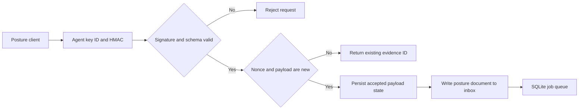
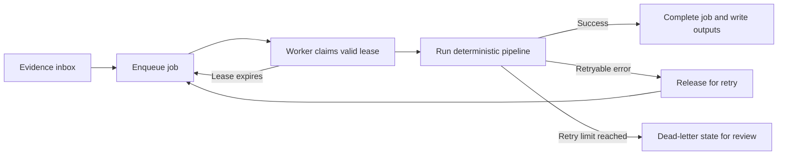
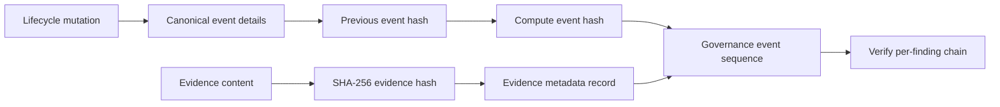
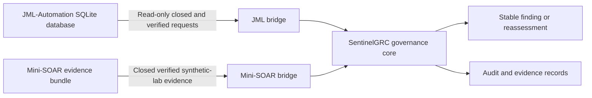
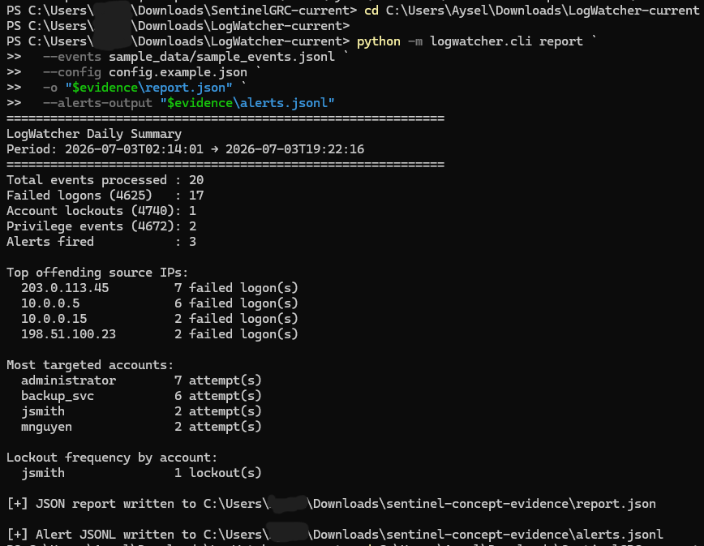
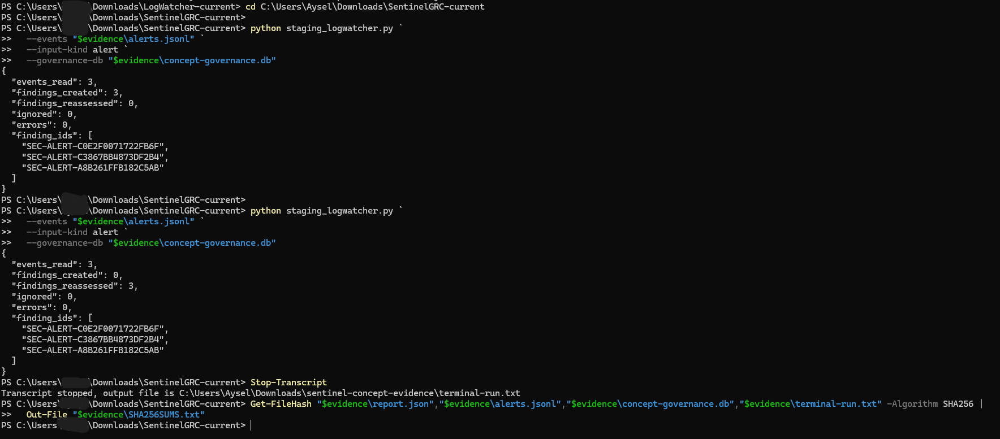

# SentinelGRC

**A Python concept MVP that turns security-control observations into traceable findings, governed remediation decisions, evidence, verification, and closure.**

**Stack:** Python standard library, SQLite, JSON and JSONL fixtures, PowerShell posture collectors, and GitHub Actions. The CI workflow uses Python 3.12.

**Status:** Portfolio / concept MVP. It completes a bounded security-governance workflow end to end, but it is not production-ready.

## What it is

Security teams often receive posture failures and alerts without a consistent way to assign ownership, approve treatment, retain evidence, and prove that remediation was independently checked. SentinelGRC models that workflow in a small, inspectable Python codebase.

It accepts normalized control observations and security alerts, derives stable findings, records risk treatment decisions, and keeps evidence and audit records linked to each finding. The repository includes synthetic concept validation with LogWatcher alerts and read-only portfolio bridges for JML-Automation and Mini-SOAR.

This repository does **not** claim ISO certification, ISMS replacement, live SIEM or Elastic integration, a production Active Directory connection, or readiness for an organisation-wide deployment. It does not make automatic changes to Active Directory or endpoints.

## How it works

`security_pack.py` and `security_event_connector.py` normalize control observations or alerts. `GovernanceCore` owns the relational finding lifecycle. The HTTP adapter authenticates a human actor through the local identity store; agent ingestion uses HMAC-backed agent keys and persistent replay state. Reports, queues, and audit/evidence records are outputs of the workflow rather than sources of authority.


```mermaid
flowchart LR
    subgraph Inputs
        P["Posture and access-review JSON"]
        L["LogWatcher alert JSONL"]
        B["Read-only JML and Mini-SOAR bridges"]
    end

    subgraph TrustBoundaries["Validation and identity boundaries"]
        A["Agent HMAC and replay checks"]
        H["Human API key authentication"]
        N["Normalize controls and alerts"]
    end

    subgraph Governance["Governance core"]
        F["Stable finding upsert"]
        R["Risk and treatment"]
        G["Role-gated approval"]
        W["Action and evidence"]
        V["Independent verification and closure"]
    end

    subgraph Outputs
        Q["Remediation queue and SLA tickets"]
        E["Evidence metadata and hash-chained audit"]
        O["Executive report"]
    end

    P --> A --> N
    L --> N
    B --> N
    H --> G
    N --> F --> R --> G --> W --> V
    W --> Q
    W --> E
    V --> O
    V --> E
```

### Finding lifecycle

The lifecycle is enforced by `governance_core.py`. A risk owner cannot approve their own finding, and an implementer or evidence submitter cannot verify the same finding.


```mermaid
stateDiagram-v2
    [*] --> Open
    Open --> RiskAssessed: assess risk
    RiskAssessed --> PendingApproval: propose treatment
    PendingApproval --> Approved: approve mitigation
    PendingApproval --> Accepted: approve risk acceptance
    PendingApproval --> RiskAssessed: reject treatment
    Approved --> InProgress: start action
    InProgress --> PendingVerification: submit evidence
    PendingVerification --> Verified: independent verification passes
    PendingVerification --> InProgress: independent verification fails
    Verified --> Closed: authorised closure
    Accepted --> Closed: authorised closure
    Closed --> [*]
```

The normal remediation path is `Open` through `Closed`. A failed independent check returns the finding to `InProgress`; an approved risk-acceptance treatment takes the controlled `Accepted` path and still requires authorised closure. There is no transition that allows a finding to skip approval, evidence, or verification.

### Alert intake and idempotent replay

`connectors.py`, `security_event_connector.py`, and `GovernanceCore.upsert_finding()` separate a newly observed alert from a replay. The event identity includes its source, so two sources can use the same event identifier without being treated as the same event.


```mermaid
flowchart LR
    S["Security alert or control observation"] --> V["Validate schema and source"]
    V --> K["Derive source and stable identity"]
    K --> D{"Previously accepted"}
    D -->|"No"| C["Create finding"]
    D -->|"Yes"| R["Reassess existing finding"]
    C --> E["Record governance event"]
    R --> E
    E --> O["Return finding ID and outcome"]
```

The first LogWatcher concept run takes the **Create finding** path for three alerts. Replaying the same three alerts takes the **Reassess existing finding** path, so the database contains three findings rather than six.

### Authenticated agent ingestion

The HTTP ingestion path is intentionally separate from the human governance API. An agent must present a known key ID and a valid HMAC signature; nonce and payload state reject replay before a posture document is accepted for downstream processing.


```mermaid
flowchart LR
    A["Posture client"] --> H["Agent key ID and HMAC"]
    H --> V{"Signature and schema valid"}
    V -->|"No"| X["Reject request"]
    V -->|"Yes"| N{"Nonce and payload are new"}
    N -->|"No"| I["Return existing evidence ID"]
    N -->|"Yes"| S["Persist accepted payload state"]
    S --> B["Write posture document to inbox"]
    B --> Q["SQLite job queue"]
```

This flow is implemented for the local lab using per-agent key lifecycle and SQLite state. It is not a substitute for TLS, mTLS, a secret manager, or a shared production replay store.

### Background worker and recovery path

`scripts/pipeline_worker.py` keeps ingestion responsive by processing inbox files through `job_queue.py`. A worker owns a job only while its lease is valid; a stale worker cannot later mark a reclaimed job complete or failed.


```mermaid
flowchart LR
    I["Evidence inbox"] --> Q["Enqueue job"]
    Q --> C["Worker claims valid lease"]
    C --> P["Run deterministic pipeline"]
    P -->|"Success"| OK["Complete job and write outputs"]
    P -->|"Retryable error"| R["Release for retry"]
    R --> Q
    P -->|"Retry limit reached"| D["Dead-letter state for review"]
    C -->|"Lease expires"| Q
```

The queue provides local retry, lease, and dead-letter behaviour for a concept environment. It is not a managed message broker and should not be used as the production queue.

### Evidence and audit integrity

Every governance mutation records a deterministic event sequence. Evidence content is hashed before its metadata is recorded, and the event chain links each event to the hash of its predecessor.


```mermaid
flowchart LR
    M["Lifecycle mutation"] --> J["Canonical event details"]
    J --> P["Previous event hash"]
    P --> H["Compute event hash"]
    H --> L["Governance event sequence"]
    E["Evidence content"] --> S["SHA-256 evidence hash"]
    S --> G["Evidence metadata record"]
    G --> L
    L --> V["Verify per-finding chain"]
```

The hashes detect changes to recorded data in the local ledger. They do not make a local SQLite file immutable; immutable storage and retained exports are production requirements.

### Connected portfolio boundaries

The repository has two narrow portfolio bridges. They feed SentinelGRC as evidence sources but do not import external code, operate external systems, or turn SentinelGRC into a response platform.


```mermaid
flowchart LR
    J["JML-Automation SQLite database"] -->|"Read-only closed and verified requests"| JB["JML bridge"]
    M["Mini-SOAR evidence bundle"] -->|"Closed verified synthetic-lab evidence"| MB["Mini-SOAR bridge"]
    JB --> G["SentinelGRC governance core"]
    MB --> G
    G --> F["Stable finding or reassessment"]
    G --> A["Audit and evidence records"]
```

The JML bridge requires a closed request and a passing verification record. The Mini-SOAR bridge accepts synthetic-lab evidence and requires passing verification by default. Both boundaries are implemented and tested locally; neither is a live production integration.

## Commands used

The repository has no third-party Python package requirement for the concept workflow. Use a supported Python installation; GitHub Actions validates the code with Python 3.12.

### 1. Initialise a local runtime area

```powershell
git clone https://github.com/SuriyaBoon/SentinelGRC.git
cd SentinelGRC
python --version
New-Item -ItemType Directory -Force runtime | Out-Null
```

### 2. Evaluate the bundled posture fixture

```powershell
python -m scripts.governance assess `
  --posture sample_posture.json `
  --controls controls.json `
  --assets assets.json `
  --output runtime/control-assessment.json
```

### 3. Run the end-to-end control pipeline

```powershell
python -m scripts.pipeline run `
  --posture sample_posture.json `
  --controls controls.json `
  --assets assets.json `
  --access-review sample_ad_access_review.json `
  --ledger runtime/evidence-ledger.jsonl `
  --remediation runtime/remediation-queue.json `
  --tickets runtime/tickets.json `
  --report runtime/executive-report.json `
  --state-db runtime/sentinel-state.db `
  --audit-log runtime/audit-log.jsonl `
  --governance-db runtime/governance.db
```

### 4. Reproduce the LogWatcher concept validation

The tracked alert fixture is the sanitized output from the LogWatcher sample scenario.

```powershell
python -m scripts.staging_logwatcher `
  --events docs/evidence/concept-validation/alerts.jsonl `
  --input-kind alert `
  --governance-db runtime/concept-governance.db
```

Run the exact same command a second time against the same database to test replay idempotency.

### 5. Run tests and inspect generated evidence

```powershell
python -m unittest discover -v -p "test_*.py"

Get-Content runtime/executive-report.json
Get-Content runtime/remediation-queue.json
Get-Content runtime/evidence-ledger.jsonl
Get-Content docs/evidence/concept-validation/SHA256SUMS.txt
Get-FileHash docs/evidence/concept-validation/*.png, docs/evidence/concept-validation/*.json* -Algorithm SHA256
```

Runtime databases, reports, queues, and ledgers are intentionally ignored by Git. They may contain local machine metadata and should not be committed.

## Evidence that it works

### Automated verification

The current test command is:

```powershell
python -m unittest discover -v -p "test_*.py"
```

Current verified result:

```text
Ran 106 tests
OK
```

GitHub Actions runs the same test discovery command, parses both PowerShell collectors, and checks that runtime artifacts are not tracked.

### Synthetic-lab integration proof

The tracked evidence package is in [`docs/evidence/concept-validation`](docs/evidence/concept-validation/).

| File | What it proves |
| --- | --- |
| [`01-logwatcher-report.png`](docs/evidence/concept-validation/01-logwatcher-report.png) | A sanitized LogWatcher run processed 20 Windows-style events and fired 3 alerts. |
| [`02-sentinel-replay.png`](docs/evidence/concept-validation/02-sentinel-replay.png) | First Sentinel ingestion created 3 findings; replay created 0 findings and reassessed 3. |
| [`alerts.jsonl`](docs/evidence/concept-validation/alerts.jsonl) | The three structured alert records submitted to the staging connector. |
| [`report.json`](docs/evidence/concept-validation/report.json) | Machine-readable totals for the source scenario, including 20 events and 3 alerts. |
| [`SHA256SUMS.txt`](docs/evidence/concept-validation/SHA256SUMS.txt) | SHA-256 checksums for the tracked screenshots and data files. |





The validated scenario is deliberately bounded:

```text
Source scenario: 20 sample events -> 3 alerts
First Sentinel run: 3 findings created, 0 reassessed, 0 errors
Replay of the same alerts: 0 findings created, 3 reassessed, 0 errors
```

This is evidence of synthetic-lab alert normalization and idempotent finding handling. It is not evidence of a live Windows fleet, Elastic, SIEM, or production environment.

## What problem it solves

The practical problem is the gap between a technical signal and an accountable outcome. A failed control, privileged-account concern, or detection alert can otherwise remain a spreadsheet entry or an isolated ticket with no reliable risk owner, approval record, evidence, or re-check.

SentinelGRC makes that path visible: normalize the observation, create or reassess one stable finding, assign a treatment decision, collect evidence, require independent verification, and preserve the resulting audit trail. This is useful as a portfolio demonstration of security governance and IT operations thinking, not as a replacement for an operational GRC programme.

## Safety model

The following guardrails are implemented in code and covered by tests:

- **Server-derived human actor:** `GovernanceApi` rejects actor fields in request bodies and resolves the actor through `HumanIdentityStore`.
- **Role-gated workflow:** only specified roles can assess, approve, verify, or close a finding; self-approval and self-verification are rejected in `GovernanceCore`.
- **Agent authentication and replay protection:** `scripts/ingestion_api.py`, `scripts/agent_keys.py`, and `state_store.py` validate HMAC-backed agent identity, nonces, and payload hashes.
- **Idempotent finding identity:** repeated LogWatcher alerts and bridged evidence reassess the same finding rather than creating duplicates.
- **Integrity records:** governance events are hash chained in a deterministic per-finding sequence; submitted evidence is SHA-256 hashed.
- **Bounded lab automation:** the repository collects and evaluates data. It does not automatically remediate endpoints or modify Active Directory.
- **Worker lease fencing:** a stale queue worker cannot complete or fail a job after its lease is no longer valid.

## Repository structure

```text
SentinelGRC/
├── governance_core.py          # Finding, risk, approval, evidence, verification, closure state machine
├── governance_api.py           # Transport-neutral authenticated workflow dispatcher
├── governance_http.py          # Minimal HTTP adapter and request limits
├── human_identity.py           # Local users and hashed human API keys for the lab
├── security_pack.py            # Control observation normalization
├── security_event_connector.py # Alert-to-finding mapping
├── connectors.py               # Connector event identity and replay state
├── state_store.py              # Nonce, payload, and pipeline-run persistence
├── job_queue.py                # SQLite queue leases, retry, and dead-letter state
├── audit_log.py                # Append-only hash-chained operational audit log
├── reporting.py                # Summary and KPI/KRI report generation
├── scripts/                    # CLI adapters, pipeline, worker, ingestion, and portfolio bridges
├── agent/                      # Read-only Windows posture and AD access-review collectors
├── migrations/                 # PostgreSQL migration contracts for a future deployment path
├── docs/evidence/              # Sanitized synthetic-lab proof package
├── ui/                         # Static workflow UI shell
└── test_*.py                   # Automated unit and integration-style concept tests
```

## Production boundary

This repository is **not** a production deployment. Before even a limited internal pilot, it would need at least:

- PostgreSQL configured as the authoritative workflow database and tested migration/rollback procedures; SQLite is the current lab store.
- Real OIDC or SSO with MFA, short-lived tokens, role/group mapping, and lifecycle-managed service identities; local hashed API keys are only the current concept mechanism.
- A secrets manager, TLS termination, network policy, rate limiting, and a hardened WSGI or ASGI server around the HTTP adapter.
- Encrypted object storage with retention and immutable export for evidence; local JSON, JSONL, and SQLite files are not an evidence vault.
- A managed durable queue and supervised workers; the current queue is SQLite polling with lease and retry logic.
- Centralized logging, metrics, tracing, alerting, backup/restore tests, disaster-recovery procedures, and security assessment.
- A real connector test against an authorised Windows and SIEM environment, including failure recovery and access-control validation.

The PostgreSQL, OIDC, deployment, and observability modules or documents define part of this path, but they are not proof that those external controls have been deployed.

## Planned integration

| Integration | Current status |
| --- | --- |
| LogWatcher | **Connected and validated at synthetic-lab level.** The tracked fixture demonstrates 20 source events, 3 alerts, and idempotent finding replay. |
| JML-Automation | **Implemented as a read-only portfolio bridge and covered by repository tests.** It requires closed requests with passing verification records. No live directory changes are made. |
| Mini-SOAR | **Implemented as a synthetic-evidence bridge and covered by repository tests.** It accepts `synthetic-lab` evidence and requires independent verification by default. |
| Windows, Elastic, SIEM, ITSM, object storage, and SSO | **Designed or documented, not validated as live integrations in this repository.** |

For the deployment outline and remaining infrastructure requirements, see [`docs/production-runbook.md`](docs/production-runbook.md) and [`docs/enterprise-deployment.md`](docs/enterprise-deployment.md).
