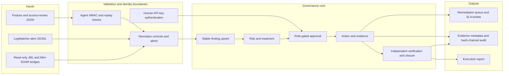
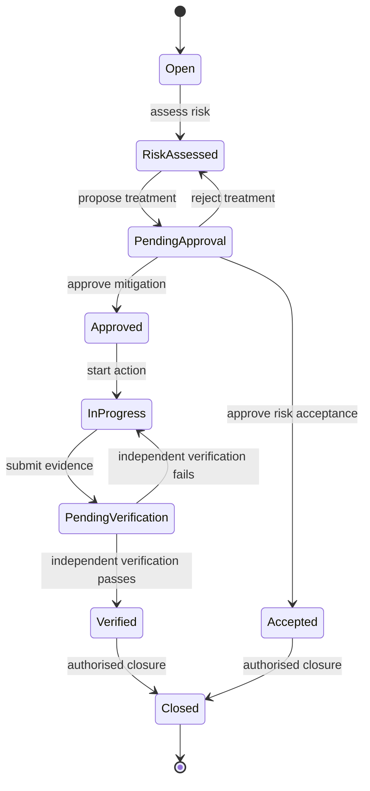
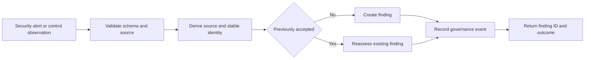
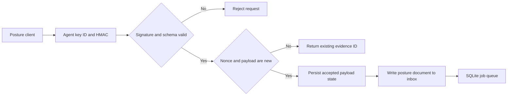
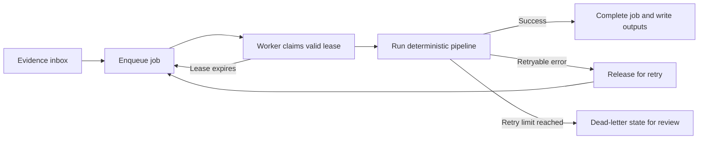
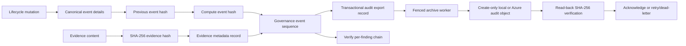
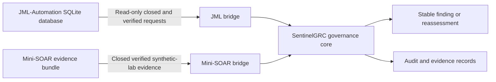
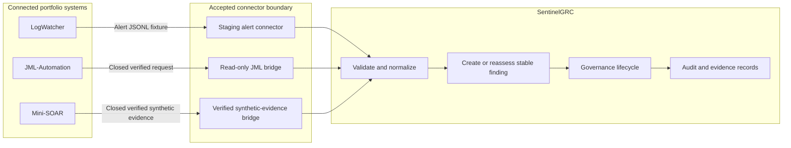

# System overview

## How it works

`security_pack.py` and `security_event_connector.py` normalize control observations or alerts. `GovernanceCore` owns the relational finding lifecycle. The HTTP adapter authenticates a human actor through the local identity store; agent ingestion uses HMAC-backed agent keys and persistent replay state. Reports, queues, and audit/evidence records are outputs of the workflow rather than sources of authority.

### Finding lifecycle

The lifecycle is enforced by `governance_core.py`. A risk owner cannot approve their own finding, and an implementer or evidence submitter cannot verify the same finding.

The normal remediation path is `Open` through `Closed`. A failed independent check returns the finding to `InProgress`; an approved risk-acceptance treatment takes the controlled `Accepted` path and still requires authorised closure. There is no transition that allows a finding to skip approval, evidence, or verification.

### Alert intake and idempotent replay

`connectors.py`, `security_event_connector.py`, and `GovernanceCore.upsert_finding()` separate a newly observed alert from a replay. The event identity includes its source, so two sources can use the same event identifier without being treated as the same event.

The first LogWatcher concept run takes the **Create finding** path for three alerts. Replaying the same three alerts takes the **Reassess existing finding** path, so the database contains three findings rather than six.

### Authenticated agent ingestion

The HTTP ingestion path is intentionally separate from the human governance API. An agent must present a known key ID and a valid HMAC signature; nonce and payload state reject replay before a posture document is accepted for downstream processing.

This flow is implemented for the local lab using per-agent key lifecycle and SQLite state. It is not a substitute for TLS, mTLS, a secret manager, or a shared production replay store.

### Background worker and recovery path

`scripts/pipeline_worker.py` keeps ingestion responsive by processing inbox files through `job_queue.py`. A worker owns a job only while its lease is valid; a stale worker cannot later mark a reclaimed job complete or failed.

The queue provides local retry, lease, and dead-letter behaviour for a concept environment. It is not a managed message broker and should not be used as the production queue.

### Evidence and audit integrity

Every governance mutation records a deterministic event sequence. Evidence content is hashed before its metadata is recorded, and the event chain links each event to the hash of its predecessor.

The governance event and its audit-export record commit in the same database
transaction. The worker preserves per-finding order, uses deterministic
server-generated object names, and acknowledges delivery only after reading the
object back and verifying its SHA-256. A failed archive remains visible for
retry or dead-letter review. The lab filesystem is not immutable; Azure
retention becomes enforceable only after the operator validates and locks the
container policy.

Governance events also create a transactional broker-outbox record. A separate
fenced worker publishes canonical `governance.event.v1` messages. Lab runs use
create-only local files; staging is configured for Azure Service Bus with a
user-assigned managed identity. The stable `outbox_id` is the broker
`MessageId`, and the finding ID is both the session and partition key. This
allows duplicate detection and preserves per-finding publish order without
making Service Bus authoritative for governance state.

### Connected portfolio boundaries

The repository has two narrow portfolio bridges. They feed SentinelGRC as evidence sources but do not import external code, operate external systems, or turn SentinelGRC into a response platform.

The JML bridge requires a closed request and a passing verification record. The Mini-SOAR bridge accepts synthetic-lab evidence, requires passing verification by default, and requires the bundle manifest digest to be pinned through a trusted channel outside the evidence directory. Both boundaries are implemented and tested locally; neither is a live production integration.

### Connected systems map

This is the single map for the three connected portfolio systems. **LogWatcher** provides a validated synthetic alert fixture. **JML-Automation** is read through SQLite in read-only mode. **Mini-SOAR** provides only closed, independently verified `synthetic-lab` evidence. SentinelGRC is the common governance and evidence sink; none of these connections can change the source system.

The three paths differ in their trust condition, but converge only after validation and stable-identity handling. The LogWatcher path has tracked concept proof of first ingestion and replay. The JML and Mini-SOAR paths are covered by local bridge tests. All three remain portfolio integrations, not live production connectors.
