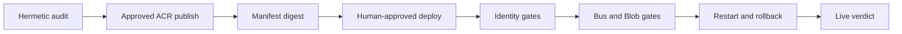

# Azure Live Validation

Task: `DEV-da632e84d041c33a`

These fail-closed gates require real Azure staging. The hermetic audit is a
prerequisite, not a substitute.

## Required gates

- [ ] Real Entra OIDC proves separate analyst and approver identities.
- [ ] The revision uses Managed Identity, not embedded keys or connection strings.
- [ ] Evidence and audit objects land only in approved Blob paths.
- [ ] Service Bus delivers; repeated failure reaches dead-letter; recovery loses no message.
- [ ] A platform restart preserves authoritative state.
- [ ] Rollback to the last-known-good digest leaves no orphaned work.
- [ ] The live revision reports the exact approved ACR runtime digest.
- [ ] Validation jobs use the assurance digest; app and outbox use runtime digest.
- [ ] Recovery creates no duplicate evidence, audit, finding, or outbox record.
- [ ] Controlled-failure alerts fire and automatically resolve after recovery.
- [ ] Sanitized evidence records resource IDs, revision, digests, timestamps,
  results, and operator identities without secrets.

Publishing is not deployment. PRs receive no Azure credentials. Missing
evidence, mutable tags, unresolved alerts, shared role identity, failed restore,
or duplicate records blocks go-live; tests and successful builds cannot override
a failed live gate.
