# Azure Live Validation

Task: `DEV-ddd863e5683f35e8`

## Scope

These gates require the real Azure staging environment. They are not replaced
by mocks in GitHub CI. The hermetic audit in
`docs/hermetic-ci-runtime-audit.md` is a prerequisite, not a substitute.

## Required gates

- [ ] Real Entra ID OIDC authentication and separate analyst and approver
      identities are exercised against the tenant configuration.
- [ ] The running revision uses Managed Identity for Azure dependencies and
      does not use embedded connection strings or account keys.
- [ ] Evidence and audit artifacts land only in their configured Blob
      containers and prefixes.
- [ ] Service Bus delivery succeeds, repeated failure reaches the dead-letter
      queue, and recovery does not silently drop a message.
- [ ] A Container Apps platform restart recovers the revision and preserves
      authoritative state.
- [ ] Revision rollback to the last known good digest leaves no orphaned
      in-flight work.
- [ ] The image reference reported by the live revision exactly matches the
      ACR `repository@sha256:digest` produced by the approved release workflow.
- [ ] Analyst and approver validation jobs use the separate assurance image
      digest, while the application and outbox sidecar use the runtime digest.
- [ ] Failure and recovery create no duplicate evidence, audit, finding, or
      outbox records for the same idempotency identity.
- [ ] Monitoring alerts fire during the controlled failure and automatically
      resolve after recovery.
- [ ] Sanitized evidence records the resource IDs, revision, image digest,
      timestamps, gate results, and operator identities without secrets.

## Release boundary

The release workflow may publish an image and digest only after hermetic gates
pass. Deployment remains a separate human-approved action. Pull requests do not
receive Azure credentials and do not push to ACR.

## Evidence flow

```mermaid
flowchart LR
    CI["Hermetic audit passed"] --> Publish["Approved ACR publish"]
    Publish --> Digest["Registry manifest digest"]
    Digest --> Deploy["Human-approved digest deployment"]
    Deploy --> Identity["Entra and Managed Identity"]
    Identity --> Delivery["Service Bus and Blob evidence"]
    Delivery --> Recovery["Restart and rollback"]
    Recovery --> Verdict["Sanitized live-gate verdict"]
```

## Verdict rule

The live track remains fail-closed. A missing evidence item, mutable tag,
unresolved alert, shared role identity, failed restore, or duplicate record
prevents a go-live verdict. Passing unit tests or a successful container build
cannot override a failed live gate.
