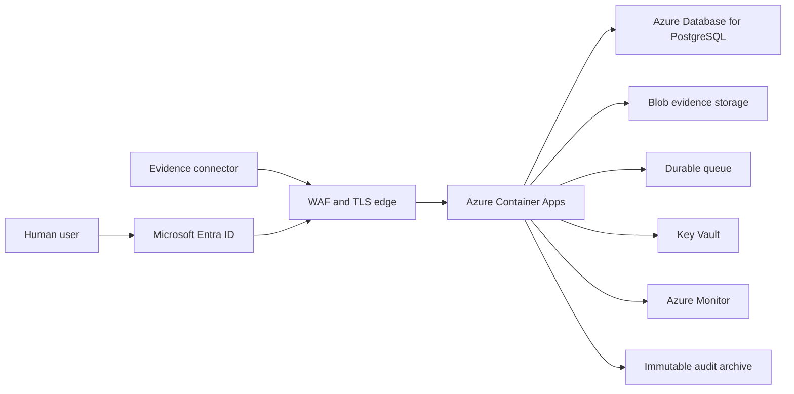

# Azure production pilot boundary

## Implemented in this phase

SentinelGRC now has a WSGI runtime entry point (`runtime_app:application`),
strict environment parsing, separate liveness and readiness responses, a pinned
non-root container image, and a Linux container smoke test in CI.

The canonical governance and human-identity path supports SQLite for local
lab/staging runs and PostgreSQL for shared-state staging validation. PostgreSQL
uses a bounded connection pool, transactional checksum-protected migrations,
row locks for per-finding event sequencing, and readiness probes. CI exercises
the lifecycle, identity, rollback, idempotency, and concurrency behavior
against an ephemeral PostgreSQL 17 service.

Staging now verifies bearer-token signatures against a configured HTTPS JWKS,
allows only RS256, and validates issuer, audience, tenant, time claims, and key
identity before creating an actor. Sentinel roles come only from configured
Microsoft Entra app-role or group mappings. Local API keys remain lab-only.

Staging evidence bytes now cross a bounded content-addressed store interface.
The Azure adapter uses a user-assigned managed identity, create-only writes,
bounded retries and timeouts, ETag capture, and read-after-write SHA-256
verification before governance metadata is committed. The lab adapter remains
local-only.

Governance events now create ordered audit-export records in the same database
transaction. A bounded worker archives canonical events through a local lab
adapter or a managed-identity Azure Blob adapter, verifies the stored bytes and
metadata, and records success, retry, or dead-letter state. Crash replay is
create-only and idempotent.

`SENTINEL_ENV=production` still fails startup until the real container
retention policy, managed identity, worker supervision, delivery monitoring,
and recovery procedure are validated. Repository tests do not prove an Azure
deployment or a locked WORM policy.

## Target Azure topology

## Required before production startup can be enabled

1. Connect the PostgreSQL transactional outbox to an Azure Service Bus worker,
   monitor delivery lag, and retain dead-letter operations. Connector replay,
   fenced queue claims, and outbox state are repository-tested, but no external
   broker or publisher has been deployed.
2. Provision and validate the real Entra application registration, app roles,
   assignments, Conditional Access/MFA policy, issuer, audience, tenant, and
   JWKS values in the target staging tenant.
3. Provision and validate the managed-identity Blob adapter against the real
   private evidence container, including retry, orphan reconciliation,
   retention, and restore scenarios.
4. Replace remaining legacy pipeline filesystem outputs with export-only
   adapters; PostgreSQL governance events already create transactional outbox
   records.
5. Deploy and supervise the implemented audit worker, validate create-only
   delivery and dead-letter recovery against the private audit container, then
   lock the reviewed retention policy and monitor export lag.
6. Provision Azure resources through reviewed IaC, private networking, managed
   identities, Key Vault references, backups, alerts, and restore tests.

Until these gates are implemented and validated in an Azure staging
environment, the image is a production-shaped staging runtime, not an approved
production release.
