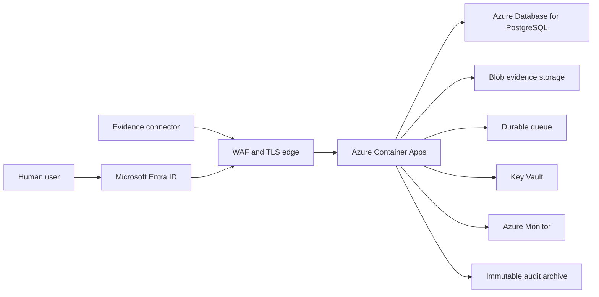

# Azure production pilot boundary

## Implemented in this phase

SentinelGRC now has a WSGI runtime entry point (`runtime_app:application`),
strict environment parsing, separate liveness and readiness responses, a pinned
non-root container image, and a Linux container smoke test in CI.

The container is intentionally usable only in `lab` or `staging` mode with
SQLite. `SENTINEL_ENV=production` fails startup even when production-looking
URLs are supplied. This prevents the repository's contractual PostgreSQL and
OIDC modules from being mistaken for working integrations.

## Target Azure topology

## Required before production startup can be enabled

1. Replace SQLite-specific governance, identity, connector, queue, and migration
   code with tested PostgreSQL adapters and transactional migrations.
2. Verify Entra access-token signatures, issuer, audience, expiry, tenant, and
   role/group mapping inside trusted middleware; `oidc_contract.py` only maps
   claims that another component has already verified.
3. Store evidence bytes in encrypted Blob Storage and keep only immutable
   metadata and hashes in PostgreSQL.
4. Use a durable queue and transactional outbox instead of filesystem polling
   and dual-write business state.
5. Export audit events to a retention-locked immutable container and monitor
   export lag.
6. Provision Azure resources through reviewed IaC, private networking, managed
   identities, Key Vault references, backups, alerts, and restore tests.

Until these gates are implemented and validated in an Azure staging
environment, the image is a production-shaped staging runtime, not an approved
production release.
