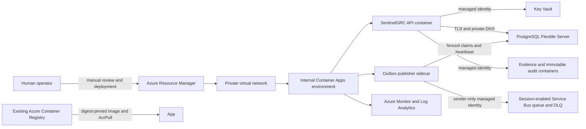

# Azure staging deployment runbook

## Purpose and boundary

This runbook describes a **manual staging deployment** of the reviewed Bicep
templates in `infra/azure`. It does not authorize deployment, create an Azure
subscription, configure Microsoft Entra, publish an image, or enable
`SENTINEL_ENV=production`.

The staging runtime includes verified OIDC middleware, a managed-identity Azure
Blob evidence adapter, and a managed-identity audit archive adapter with an
ordered retry/dead-letter worker. Production startup remains blocked until the
real retention policy and worker delivery controls are validated. Provisioning
the resources below is not proof that these controls have been validated in a
real Azure tenant.



## User-owned prerequisites

The operator must supply and own all of the following:

- an Azure tenant and subscription with a cost owner;
- a target resource group and supported Azure region;
- permission to deploy resources and create role assignments;
- an existing Premium Azure Container Registry that permits Private Link;
- a SentinelGRC image pushed to that registry and referenced by its
  `sha256` digest;
- a Microsoft Entra application registration, issuer, audience, role/group
  design, and Conditional Access/MFA policy;
- a private access path for operators, such as an approved VPN, ExpressRoute,
  or controlled Azure-hosted administration environment;
- an approved PostgreSQL bootstrap username and a password stored outside Git.

The repository cannot create or approve these organisational inputs.

## Cost boundary

The template creates billable resources, including Container Apps,
PostgreSQL Flexible Server, Service Bus Premium, private endpoints, private
DNS zones, Blob Storage, Key Vault, Log Analytics, and Application Insights.
The defaults reduce staging cost but are not a price guarantee. Before
deployment, the owner must use the Azure Pricing Calculator, approve a monthly
budget, configure budget alerts, and confirm regional availability.

High availability and geo-redundant database backup are intentionally disabled
for this staging template. That saves cost but is not an acceptable final
production posture.

## 1. Install tools and authenticate

Use a current Azure CLI and Bicep CLI. Confirm the selected tenant and
subscription before any mutation:

```powershell
az version
az bicep install --version v0.45.15
az login --tenant "<tenant-id>"
az account set --subscription "<subscription-id>"
az account show --query "{tenant:tenantId,subscription:id,name:name}" --output table
```

Register the required providers once per subscription:

```powershell
az provider register --namespace Microsoft.App
az provider register --namespace Microsoft.ContainerRegistry
az provider register --namespace Microsoft.DBforPostgreSQL
az provider register --namespace Microsoft.Insights
az provider register --namespace Microsoft.KeyVault
az provider register --namespace Microsoft.ManagedIdentity
az provider register --namespace Microsoft.Network
az provider register --namespace Microsoft.OperationalInsights
az provider register --namespace Microsoft.ServiceBus
az provider register --namespace Microsoft.Storage
```

Provider registration changes subscription state and requires explicit owner
approval.

## 2. Prepare local inputs

Copy the identifier-only example. The resulting `.bicepparam` file is ignored
by Git:

```powershell
Copy-Item infra\azure\main.staging.bicepparam.example `
  infra\azure\main.staging.bicepparam
```

Replace every placeholder in the copied file. Retrieve the immutable image
digest from ACR:

```powershell
$digest = az acr repository show `
  --name "<acr-name>" `
  --image "sentinelgrc:<reviewed-tag>" `
  --query digest `
  --output tsv

$image = "<acr-name>.azurecr.io/sentinelgrc@$digest"

$validationDigest = az acr repository show `
  --name "<acr-name>" `
  --image "sentinelgrc-assurance:<reviewed-tag>" `
  --query digest `
  --output tsv

$validationImage = "<acr-name>.azurecr.io/sentinelgrc-assurance@$validationDigest"
```

Run the repository preflight. It performs no Azure mutation:

```powershell
.\scripts\Test-AzureStagingInputs.ps1 `
  -ContainerImage $image `
  -ValidationContainerImage $validationImage `
  -RegistrySubscriptionId "<acr-subscription-id>" `
  -RegistryResourceGroup "<acr-resource-group>" `
  -RegistryName "<acr-name>" `
  -OidcIssuer "https://login.microsoftonline.com/<tenant-id>/v2.0" `
  -OidcAudience "<sentinel-application-id>" `
  -OidcTenantId "<tenant-id>" `
  -OidcJwksUrl "https://login.microsoftonline.com/<tenant-id>/discovery/v2.0/keys"
```

`OidcAudience` is the application client ID GUID that the API expects in the
`aud` claim of an Entra v2 access token. It is deliberately different from the
managed-identity token request scope, which remains
`api://<sentinel-application-id>/.default`.

Expected result:

```json
{
  "status": "valid",
  "image_is_digest_pinned": true,
  "azure_mutation_performed": false
}
```

## 3. Compile without Azure access

The CI compiler image and Bicep version are pinned. This command mounts the
repository read-only and writes the generated ARM JSON only inside the
disposable container:

```powershell
docker run --rm `
  --mount "type=bind,source=$PWD,target=/src,readonly" `
  --entrypoint /bin/sh `
  mcr.microsoft.com/azure-cli@sha256:23b520868509add054d385d90dc3fc5268f10a2f58947a994e30babe938e31ae `
  -c "az bicep install --version v0.45.15 && az bicep build --file /src/infra/azure/main.bicep --outfile /tmp/main.json"
```

## 4. Preview the Azure change

Create the resource group only after location and cost approval:

```powershell
$resourceGroup = "<sentinel-staging-resource-group>"
$location = "<approved-region>"
az group create --name $resourceGroup --location $location
```

Set the bootstrap password only in the current process. Do not place it in
shell history, screenshots, Git, a parameter file, or CI logs:

```powershell
$securePassword = Read-Host "PostgreSQL bootstrap password" -AsSecureString
$credential = New-Object System.Management.Automation.PSCredential("unused", $securePassword)
$env:SENTINEL_DB_ADMIN_PASSWORD = $credential.GetNetworkCredential().Password
```

Compile and preview before deployment:

```powershell
az bicep build --file infra\azure\main.bicep

az deployment group what-if `
  --resource-group $resourceGroup `
  --template-file infra\azure\main.bicep `
  --parameters infra\azure\main.staging.bicepparam `
  --parameters databaseAdministratorPassword=$env:SENTINEL_DB_ADMIN_PASSWORD
```

Save the reviewed `what-if` output in the organisation's approved change
record, not in the public repository.

## 5. Deploy infrastructure first

Keep `deployApplication = false` for the first deployment. This creates the
private infrastructure and RBAC but no application revision:

```powershell
az deployment group create `
  --name "sentinelgrc-staging-infra-$(Get-Date -Format yyyyMMddHHmmss)" `
  --resource-group $resourceGroup `
  --template-file infra\azure\main.bicep `
  --parameters infra\azure\main.staging.bicepparam `
  --parameters databaseAdministratorPassword=$env:SENTINEL_DB_ADMIN_PASSWORD `
  --confirm-with-what-if
```

The existing ACR must be Premium because the template creates an ACR private
endpoint. Validate private DNS, role assignments, Key Vault, Blob, Service Bus,
and PostgreSQL before continuing.

## 6. Deploy the staging application revision

After the digest-pinned image exists and private ACR resolution is working,
change only `deployApplication` to `true`, rerun the preflight and `what-if`,
and then run the same deployment command.

The Container App is internal-only and receives a user-assigned managed
identity. The revision contains the API and a supervised outbox-publisher
sidecar. Both receive the database URL through a Key Vault reference; only the
sidecar has sender-scoped Service Bus access. No ACR password, storage key,
Service Bus connection string, or Key Vault access policy is embedded in the
application.

## 7. Validate

Validate control-plane state:

```powershell
az containerapp show `
  --name "<container-app-name>" `
  --resource-group $resourceGroup `
  --query "{fqdn:properties.configuration.ingress.fqdn,revision:properties.latestReadyRevisionName,external:properties.configuration.ingress.external}" `
  --output json

az postgres flexible-server show `
  --name "<postgres-server-name>" `
  --resource-group $resourceGroup `
  --query "{state:state,publicAccess:network.publicNetworkAccess,backupDays:backup.backupRetentionDays}" `
  --output json

az servicebus namespace show `
  --name "<service-bus-namespace>" `
  --resource-group $resourceGroup `
  --query "{status:status,localAuthDisabled:disableLocalAuth,publicAccess:publicNetworkAccess}" `
  --output json
```

From an approved private-network execution point, validate:

- `/healthz` returns HTTP 200;
- `/ready` returns HTTP 200 and both PostgreSQL stores are reachable;
- a synthetic finding completes the tested governance lifecycle;
- replay does not create a duplicate finding;
- the outbox sidecar heartbeat makes `/ready` pass only while delivery is
  current and no outbox dead letter exists;
- one synthetic lifecycle produces ordered `governance.event.v1` messages
  with the expected stable `MessageId`, finding-scoped `SessionId`, and
  `payload_sha256` property;
- stopping the sidecar makes readiness fail after the configured heartbeat
  age, and restarting it recovers without duplicate logical delivery;
- a forced send failure exercises PostgreSQL retry and exact-confirmation
  dead-letter recovery; Service Bus DLQ behavior must be tested separately by
  an authorised session-aware consumer;
- evidence and audit objects are accessible only through managed identity;
- `python audit_worker.py --max-items 100` drains synthetic audit exports in
  event order, replay creates no duplicate object, and retry/dead-letter
  metrics are retained;
- the audit immutability policy remains unlocked during validation and is
  locked only through a separately approved operator change after retention
  and recovery tests pass;
- logs contain request IDs but no secrets or bearer tokens;
- backup restore succeeds into an isolated validation server.

These checks require live operational work beyond repository tests. Do not
describe the deployment as production-ready until they pass and evidence is
retained.

## 8. Rollback

Application rollback is revision-based:

```powershell
az containerapp revision list `
  --name "<container-app-name>" `
  --resource-group $resourceGroup `
  --output table

az containerapp revision activate `
  --name "<container-app-name>" `
  --resource-group $resourceGroup `
  --revision "<last-known-good-revision>"
```

Never roll back database schema by deleting migrations. Restore PostgreSQL to a
new server, verify integrity, and perform an approved cutover.

For a disposable staging environment, delete the whole resource group only
after evidence retention, backup, legal-hold, and cost-owner approval:

```powershell
az group delete --name $resourceGroup --yes --no-wait
```

Deletion is destructive. Purge protection and immutable storage can retain
resources or data after the resource group deletion request.

## 9. Clear local secret material

```powershell
Remove-Item Env:\SENTINEL_DB_ADMIN_PASSWORD -ErrorAction SilentlyContinue
$credential = $null
$securePassword = $null
```

Close the terminal after deployment. Rotate the bootstrap password after
database identity migration and record the rotation in the approved secrets
management process.
