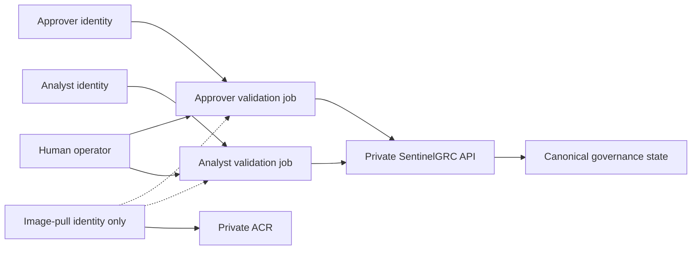

# Azure staging lifecycle validation

This staging-only rehearsal proves selected authentication, authorization, and
governance lifecycle controls from inside the private Container Apps
environment. It does not make a production-readiness claim.

## Separation-of-duties boundary

The rehearsal uses three user-assigned managed identities:

- image pull: Azure Container Registry `AcrPull` only, with no Sentinel API role;
- analyst: `sentinel-analyst` application role only;
- approver: `sentinel-approver` application role only.

Two manual Container Apps Jobs provide separate execution contexts. The
analyst job attaches only the image-pull and analyst identities. The approver
job attaches only the image-pull and approver identities. No job, container, or
validator process can request both role-bearing tokens.



## Tenant-controlled role assignment

The Bicep template creates identities and resource-scoped Azure RBAC only. A
tenant operator must assign exactly one Sentinel API application role to each
role identity. The image-pull identity must not receive any Sentinel API role.

```powershell
$api = az ad sp show --id "<sentinel-application-client-id>" | ConvertFrom-Json
$analyst = az identity show -g "<resource-group>" -n "<analyst-identity>" | ConvertFrom-Json
$approver = az identity show -g "<resource-group>" -n "<approver-identity>" | ConvertFrom-Json

$analystRole = $api.appRoles | Where-Object value -eq "sentinel-analyst"
$approverRole = $api.appRoles | Where-Object value -eq "sentinel-approver"

az ad sp app-role assignment create `
  --assignee-object-id $analyst.principalId `
  --assignee-principal-type ServicePrincipal `
  --resource-object-id $api.id `
  --app-role-id $analystRole.id

az ad sp app-role assignment create `
  --assignee-object-id $approver.principalId `
  --assignee-principal-type ServicePrincipal `
  --resource-object-id $api.id `
  --app-role-id $approverRole.id
```

Fail the gate if the role identity object IDs are equal, either role identity
has both application roles, the image-pull identity has a Sentinel API role, or
either role identity has unrelated Azure resource-plane RBAC.

## Four-phase lifecycle rehearsal

The operator generates one bounded, non-secret run identifier. Every phase
derives the same finding ID and verifies the server's canonical state before
performing its allowed transition.

```text
analyst_prepare
  -> pending_approval
approver_approve
  -> approved
analyst_remediate
  -> pending_verification
approver_close
  -> closed
```

Example PowerShell sequence:

```powershell
$runId = "live-$(Get-Date -Format yyyyMMddHHmmss)"
$rg = "<resource-group>"
$analystJob = "<analyst-validation-job>"
$approverJob = "<approver-validation-job>"

az containerapp job start -g $rg -n $analystJob `
  --env-vars "SENTINEL_VALIDATION_RUN_ID=$runId" `
             "SENTINEL_VALIDATION_PHASE=analyst_prepare"

az containerapp job start -g $rg -n $approverJob `
  --env-vars "SENTINEL_VALIDATION_RUN_ID=$runId" `
             "SENTINEL_VALIDATION_PHASE=approver_approve"

az containerapp job start -g $rg -n $analystJob `
  --env-vars "SENTINEL_VALIDATION_RUN_ID=$runId" `
             "SENTINEL_VALIDATION_PHASE=analyst_remediate"

az containerapp job start -g $rg -n $approverJob `
  --env-vars "SENTINEL_VALIDATION_RUN_ID=$runId" `
             "SENTINEL_VALIDATION_PHASE=approver_close"
```

Do not start the next phase until the previous execution succeeded and its
sanitized report shows the expected `final_finding_status` and `next_phase`.
The placeholder `REQUIRED_AT_START` is deliberately invalid, so an accidental
job start without an explicit run ID fails closed.

## Evidence handling

Each phase emits only the run ID, deterministic finding ID, current role and
phase, hashed actor fingerprint, hashed state material, gate statuses, expected
next phase, and final finding status. Tokens and raw subjects are never emitted.

Store live reports, execution IDs, timestamps, resource IDs, operator/reviewer
identity, and hashes in the approved private evidence location. Do not commit
tenant identifiers, subscription identifiers, tokens, or live reports.

## Monitoring validation

Set `deployMonitoringAlerts = true` to route Container Apps console and system
logs to Log Analytics and create two alerts:

- `Replicas < 1` for application availability;
- positive outbox `dead`, `retry`, or `stale` counts from console logs.

Both rules set `autoMitigate: true`. The live gate still requires an approved
rehearsal that observes fired and resolved states; provisioning alone does not
pass the gate. `monitoringActionGroupResourceId` remains optional so personal
notification endpoints are not embedded in the template.

## What this rehearsal does not prove

This validation does not prove backup restore, disaster recovery, sustained
capacity, external SIEM/ITSM integration, immutable retention, incident
response readiness, or organisational production approval.
