# Hermetic CI Runtime Audit

Task: `DEV-ddd863e5683f35e8`

## Scope

This audit covers checks that can run without a live Azure environment. It
proves source-to-image closure, container startup contracts, PostgreSQL
readiness behavior, deterministic pipeline replay, and supply-chain policy.
Real Entra ID, Managed Identity, Service Bus, Blob Storage, Container Apps,
and revision rollback remain in `docs/azure-live-validation.md`.

## Governed chain

```mermaid
flowchart LR
    Static["Static closure and dynamic import policy"]
    Manifest["Reviewed runtime manifest"]
    Build["Build image once"]
    Import["Import runtime entry point"]
    Positive["PostgreSQL ready"]
    Negative["PostgreSQL lost and readiness 503"]
    Crash["Deterministic crash and replay"]
    Publish["Publish tested image"]
    Digest["Capture ACR manifest digest"]
    Azure["Azure live validation"]

    Static --> Manifest --> Build --> Import --> Positive --> Negative
    Negative --> Crash --> Publish --> Digest --> Azure
```



## Required pull-request gates

- Docker Python COPY sources exactly match `docker_image_manifest.txt`.
- No staging, test, sample, or development module ships in the runtime image.
- Azure lifecycle validation utilities ship only in the separate assurance
  image built by `Dockerfile.assurance`.
- Every local runtime import is present in the image.
- Every `importlib.import_module` or `__import__` call is declared in
  `config/runtime-dynamic-import-whitelist.json` with importer, target, line,
  owner, reason, and expiry.
- Expired, malformed, stale, or unshipped dynamic-import declarations fail.
- `runtime_app` imports from the built image.
- The image runs as a non-root user with a read-only root filesystem.
- The writable runtime tmpfs is owned by UID/GID 10001 with mode 0700; a
  root-owned or world-writable replacement fails the supply-chain policy test.
- A lab runtime configured with explicit PostgreSQL URLs reports ready while
  PostgreSQL is available.
- After that same PostgreSQL instance is stopped, `/healthz` remains 200 and
  `/ready` becomes 503 with `status=not_ready` and both database checks false.
- An unreachable PostgreSQL URL at startup causes a non-zero process exit. It
  must not silently fall back to SQLite.
- Production-mode application construction exits non-zero with the explicit
  production startup block. CI must not claim production startup support.
- The controlled pipeline failpoint exits after pipeline commit and before
  queue acknowledgement. Replay must not change ledger, audit, remediation,
  ticket, or report bytes.
- Dependencies remain hash locked and no runtime secret artifact is tracked.

The application readiness endpoint is `/ready`. Database configuration uses
`SENTINEL_DATABASE_URL` and `SENTINEL_IDENTITY_DATABASE_URL`.

## Readiness contracts

### Reachable PostgreSQL

The hermetic container uses `SENTINEL_ENV=lab` so Azure-only adapters are not
mocked and mistaken for live validation. Both database URLs are explicitly set
to the PostgreSQL service. `/healthz` and `/ready` must return 200, and the
governance and identity store checks must be true.

### Dependency loss after startup

The same running container is kept alive while its PostgreSQL service is
stopped. `/healthz` must remain 200. `/ready` must return 503 within a bounded
client timeout and must report both store checks as false. This verifies real
dependency loss without allowing the Dockerfile's SQLite defaults to hide it.

### Unreachable PostgreSQL at startup

A separate application construction is run with both database URLs set to a
refused address. It must exit non-zero within a bounded timeout. The current
runtime opens its PostgreSQL pool and applies migrations during construction,
so no HTTP listener is expected in this case.

### Production mode

Production settings are validated first, then `create_application()` must fail
with the documented startup block until immutable audit retention and worker
delivery are validated in Azure. Importing `runtime_app` alone is insufficient
because the exported WSGI application is lazy.

## Deterministic crash contract

The inbox worker recognizes one test-only failpoint:

```text
SENTINEL_ENABLE_TEST_FAILPOINTS=true
SENTINEL_FAILPOINT=after_pipeline_commit_before_queue_ack
SENTINEL_ENV=lab
```

The failpoint is validated before queue creation, is rejected outside lab, and
exits with code 86 after `run_pipeline()` returns but before queue completion.
The test waits for the one-second queue lease to expire, restarts without the
failpoint, and proves replay returns `duplicate` without changing committed
business outputs. This covers the SQLite inbox worker only. Azure Service Bus
restart and dead-letter behavior remain live gates.

## Image digest handoff

Pull-request CI builds and tests an untrusted image but does not authenticate to
ACR. A separate, manually approved release workflow must:

1. Build the candidate once.
2. Run the same hermetic image checks against its immutable local image ID.
3. Tag and push those exact layers without rebuilding.
4. Build the assurance overlay from that exact runtime image and test its
   validation entry point.
5. Push both exact images and read both immutable digests with the stable
   `az acr repository show --image` command.
6. Emit both `repository@sha256:digest` references as evidence.
7. Deploy only those digests after a separate human deployment approval.

`RepoDigests` is not evidence before registry push, and a later rebuild is not
the image that CI tested.

## Current boundary

Passing this audit means the repository has a coherent production-shaped image
and hermetic failure tests. It does not mean Azure live validation or production
go-live has passed.
