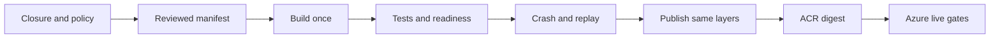

# Hermetic CI Runtime Audit

Task: `DEV-43298e415f88dfa8`

## Scope

This audit proves source-to-image closure, startup contracts, PostgreSQL
readiness, deterministic replay, and supply-chain policy without Azure. Real
Entra ID, Managed Identity, Service Bus, Blob Storage, Container Apps, and
rollback remain in `docs/azure-live-validation.md`.



## Required gates

- Docker Python sources exactly match `docker_image_manifest.txt`; staging,
  test, sample, and development modules do not ship in the runtime image.
- `Dockerfile.assurance` alone adds Azure validation utilities. Its copied
  sources are root-owned, read-only, and run as UID/GID 10001.
- Every local import is shipped. Dynamic import calls require an unexpired
  declaration in `config/runtime-dynamic-import-whitelist.json` containing
  importer, target, line, owner, reason, and expiry.
- Dependencies are hash locked and no runtime secret artifact is tracked.
- `runtime_app` imports from the built image; the container runs non-root with
  a read-only root filesystem and a UID/GID 10001 mode-0700 runtime tmpfs.
- With explicit PostgreSQL URLs, `/healthz` and `/ready` return 200 and both
  database checks are true.
- After PostgreSQL stops, `/healthz` remains 200 while `/ready` returns 503
  with `status=not_ready` and both database checks false.
- Unreachable PostgreSQL during construction exits non-zero without SQLite
  fallback. Production construction also exits with the explicit startup block.
- The test-only commit-before-ack failpoint exits after pipeline commit. Replay
  returns `duplicate` without changing ledger, audit, remediation, ticket, or
  report bytes.
- Azure Bicep compiles before any image is eligible for publication.

The readiness endpoint is `/ready`; database variables are
`SENTINEL_DATABASE_URL` and `SENTINEL_IDENTITY_DATABASE_URL`. Hermetic tests use
`SENTINEL_ENV=lab` so Azure adapters are not mocked and misreported as live.

## Deterministic crash contract

```text
SENTINEL_ENABLE_TEST_FAILPOINTS=true
SENTINEL_FAILPOINT=after_pipeline_commit_before_queue_ack
SENTINEL_ENV=lab
```

The worker rejects this failpoint outside lab, validates it before queue
creation, and exits 86 after `run_pipeline()` but before queue completion. The
test waits for the one-second lease, restarts without the failpoint, and checks
byte-stable business outputs. This covers the SQLite inbox worker only; Azure
Service Bus restart and dead-letter behavior are live gates.

## Image handoff

The manual release workflow has two jobs:

1. `qualify` has no Azure OIDC permission. It builds once and runs the full
   PostgreSQL suite, closure checks, Bicep compilation, readiness and failure
   checks, startup refusals, and replay coverage.
2. `qualify` saves both exact images and records their IDs plus bundle SHA-256.
3. `publish` depends on `qualify`, verifies the bundle and IDs, and only then
   obtains Azure OIDC access.
4. `publish` uses a tag unique to run ID, run attempt, and source SHA, pushes
   without rebuilding, then resolves both ACR manifest digests from that tag.
   Evidence records the run identity, tag, and `repository@sha256:digest` values.
5. Deployment requires separate human approval and those exact digests.

`RepoDigests` before push and a later rebuild are not qualification evidence.
Passing this audit proves a production-shaped image, not Azure validation or
production go-live.
