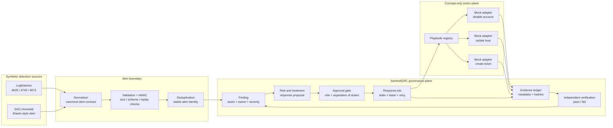
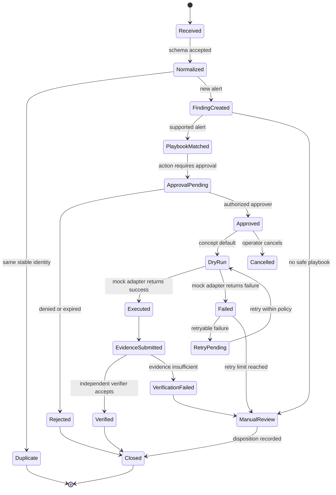

# Mini-SOAR ? Governed Response Orchestrator

## 1. Purpose

Mini-SOAR is Flagship #3 for the security portfolio. It demonstrates how a
security alert can move from detection to a controlled, reviewable response:

```text
LogWatcher / SOC-Homelab
        -> alert normalization
        -> SentinelGRC finding and risk context
        -> role-gated approval
        -> simulated response action
        -> evidence and audit trail
        -> verification and closure
```

This is a portfolio concept implementation. It must not apply changes to a
real endpoint, Active Directory, network, cloud account, EDR, SIEM, or ITSM
system.

## 2. Scope boundary

### In scope

- Synthetic LogWatcher and SOC-Homelab alerts.
- Stable alert identity and replay-safe ingestion.
- Playbook matching by alert kind, severity, and asset context.
- Risk-owner and responder separation of duties.
- Human approval before every response action.
- Dry-run and mock adapters that return deterministic results.
- Before/after response evidence, audit events, and verification state.
- Failure, timeout, retry, cancellation, and rollback demonstrations.
- Portfolio documentation and automated tests.

### Explicitly out of scope

- Live AD account disablement.
- Live host isolation or firewall changes.
- Malware deletion or process termination.
- Real cloud, EDR, SIEM, Slack, email, Jira, or ServiceNow changes.
- Autonomous approval or unrestricted LLM-generated actions.
- A claim of production readiness, enterprise deployment, or SOC replacement.

## 3. Architecture diagram



## 4. Core lifecycle



## 5. Component responsibilities

| Component | Responsibility | Portfolio implementation |
|---|---|---|
| Alert normalizer | Converts source-specific alerts into one contract | Pure Python, deterministic |
| Ingestion boundary | Authentication, schema validation, size limits | Reuse SentinelGRC connector pattern |
| Finding store | Stable identity, ownership, severity, status | Reuse governance workflow |
| Playbook registry | Maps alert type to an approved response plan | Versioned YAML/JSON fixtures |
| Approval service | Enforces actor, role, owner, and expiry rules | Reuse role-gated workflow |
| Job runner | Executes one approved plan with lease/retry state | Reuse job queue pattern |
| Action adapter | Performs the selected response operation | Mock-only adapters |
| Evidence writer | Stores request, decision, result, and hashes | Hash-chained audit/evidence records |
| Verifier | Confirms the simulated post-condition independently | Separate verifier actor/test fixture |

## 6. Canonical alert contract

The orchestrator should accept source-specific input only at the boundary.
Everything after normalization uses this shape:

```json
{
  "alert_id": "ALERT-6B7A...",
  "source": "logwatcher",
  "source_event_id": "EVT-4625-001",
  "kind": "brute_force",
  "severity": "high",
  "detected_at": "2026-07-22T10:00:00Z",
  "asset": {
    "asset_id": "WIN-DC01",
    "hostname": "WIN-DC01",
    "environment": "synthetic-lab"
  },
  "subject": {
    "account": "alice",
    "source_ip": "203.0.113.45"
  },
  "evidence_refs": ["sample://logwatcher/alerts/001"],
  "raw_payload_hash": "sha256:..."
}
```

Required invariants:

- `alert_id` is derived from stable source fields, not supplied actor fields.
- `environment` must be `synthetic-lab` for the portfolio demo.
- Unknown alert kinds are rejected or routed to manual review.
- Replaying the same alert must not create a second open finding.
- Raw payloads are treated as evidence, not as executable instructions.

## 7. Playbook registry

Playbooks are reviewed configuration, not free-form commands. Each playbook
has an explicit action allowlist, approval policy, evidence requirements, and
safe failure behavior.

| ID | Trigger | Proposed response | Approval | Default adapter |
|---|---|---|---|---|
| `PB-BF-001` | `brute_force` | Disable targeted account; create incident record | Security responder, not risk owner | `MockDisableAccount` |
| `PB-PE-001` | `privilege_escalation` | Create incident; request host isolation review | Security manager | `MockCreateTicket` |
| `PB-ML-001` | `malware` | Simulate host isolation; attach evidence | Security manager + asset owner | `MockIsolateHost` |
| `PB-UNK-001` | Unsupported or ambiguous alert | No action; manual triage | None; analyst disposition | `NoOpManualReview` |

Example playbook contract:

```yaml
id: PB-BF-001
version: 1
enabled: true
match:
  kind: brute_force
  minimum_severity: high
actions:
  - type: disable_account
    adapter: mock_disable_account
    requires_approval: true
    reversible: true
  - type: create_ticket
    adapter: mock_create_ticket
    requires_approval: true
approval:
  allowed_roles: [security_responder, security_manager]
  cannot_be: [risk_owner, implementer, verifier]
  expires_after_minutes: 30
safety:
  environment: synthetic-lab
  dry_run_default: true
  max_attempts: 2
evidence:
  required: [approval, action_result, simulated_postcondition, verifier]
```

## 8. Approval and separation of duties

The response flow must prove these controls:

1. The server derives the authenticated actor.
2. The risk owner cannot approve their own finding.
3. The implementer cannot verify their own response.
4. Approval is bound to the exact finding, playbook version, and action hash.
5. Expired, revoked, or replayed approvals cannot execute a job.
6. A playbook change invalidates approvals created for an older version.
7. Rejection and cancellation are first-class audit events.

Approval record:

```json
{
  "approval_id": "APR-001",
  "finding_id": "SEC-ALERT-001",
  "playbook_id": "PB-BF-001",
  "playbook_version": 1,
  "action_hash": "sha256:...",
  "decision": "approved",
  "actor": "security-manager-01",
  "actor_role": "security_manager",
  "expires_at": "2026-07-22T10:30:00Z",
  "reason": "Synthetic brute-force scenario requires containment demo"
}
```

## 9. Mock action model

Every adapter implements the same interface:

```text
validate(request) -> validation result
preview(request) -> planned effect
execute(request) -> action result
verify(result) -> post-condition result
rollback(result) -> rollback result, when supported
```

The adapters must only mutate an in-memory or temporary portfolio fixture:

- `MockDisableAccount` changes `enabled: true` to `enabled: false` in a
  synthetic identity store.
- `MockIsolateHost` changes `network_state: connected` to `isolated` in a
  synthetic asset store.
- `MockCreateTicket` writes a deterministic ticket JSON record.
- `NoOpManualReview` creates no side effect and records the disposition.

The output must explicitly say `simulated: true`, include the adapter name,
request hash, result status, and before/after state.

## 10. Evidence and audit package

One response should produce a reviewable package containing:

```text
response-package/
??? alert.json
??? finding.json
??? playbook.json
??? approval.json
??? action-request.json
??? action-result.json
??? verification.json
??? audit-events.jsonl
??? SHA256SUMS.txt
```

Minimum audit events:

```text
alert_received
alert_normalized
finding_created
playbook_matched
approval_requested
approval_granted|approval_rejected|approval_expired
response_started
response_completed|response_failed|response_cancelled
evidence_submitted
verification_passed|verification_failed
finding_closed
```

Each event records `event_id`, `occurred_at`, `actor`, `finding_id`,
`previous_hash`, `event_hash`, and relevant object hashes. Secrets, tokens,
absolute local paths, and runtime metadata must not be included in published
evidence.

## 11. Failure and safety scenarios

The concept must demonstrate at least these cases:

| Scenario | Expected behavior |
|---|---|
| Duplicate alert | Reassess existing finding; no second action |
| Invalid signature | Reject before parsing or storing the event |
| Unknown alert kind | Manual review; no executable action |
| Unauthorized approver | Reject and audit the attempt |
| Expired approval | Do not start the job |
| Playbook changed after approval | Reject due to action-hash mismatch |
| Adapter timeout | Retry within limit, then manual review |
| Mock action failure | Record failure; no false closure |
| Verification failure | Return to remediation/manual review |
| Cancelled response | Record cancellation and preserve evidence |
| Malformed action parameters | Fail validation; never call adapter |

## 12. Delivery phases

### Phase A ? Contract and simulation foundation

- Canonical alert, finding, playbook, approval, action, and evidence schemas.
- Three mock adapters and synthetic stores.
- Deterministic IDs and dry-run output.
- Unit tests for validation and replay protection.

### Phase B ? Governed orchestration

- Playbook matching.
- Approval binding and separation-of-duties checks.
- Job state machine with lease, retry, timeout, and cancellation.
- Hash-chained response package.

### Phase C ? Portfolio demonstration

- CLI or small UI showing the full lifecycle.
- One-click scenario runner for brute-force, privilege escalation, and
  malware-like host isolation.
- Screenshots and sanitized evidence.
- README story connecting detection, governance, response, and closure.

## 13. Acceptance criteria

The portfolio MVP is complete when it can demonstrate:

- One LogWatcher alert becoming one SentinelGRC finding.
- A duplicate replay creating zero duplicate findings.
- A matched playbook producing a proposed action without executing it.
- An unauthorized approval being rejected.
- An authorized approval starting a dry-run mock action.
- The action result containing `simulated: true` and before/after state.
- An independent verifier accepting or rejecting the post-condition.
- A complete hash-linked evidence package being generated.
- Every failure path ending in an auditable state.
- No code path capable of reaching a real external control plane.

## 14. Portfolio positioning

The strongest interview story is:

> LogWatcher and SOC-Homelab detect suspicious activity. SentinelGRC turns
> that observation into an owned, risk-assessed, approval-gated response.
> Mini-SOAR then demonstrates the response contract with safe simulated
> adapters, while preserving evidence, separation of duties, and auditability.

This shows SOC workflow understanding, automation design, governance, secure
software boundaries, and operational failure handling without claiming that a
real enterprise response system has been deployed.
