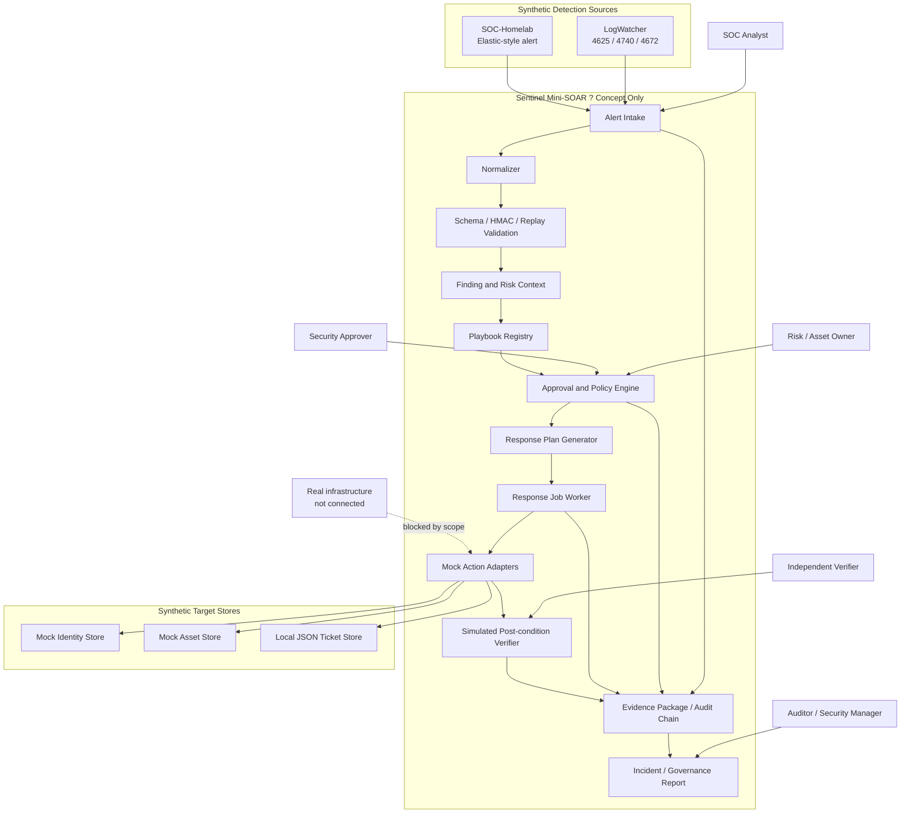
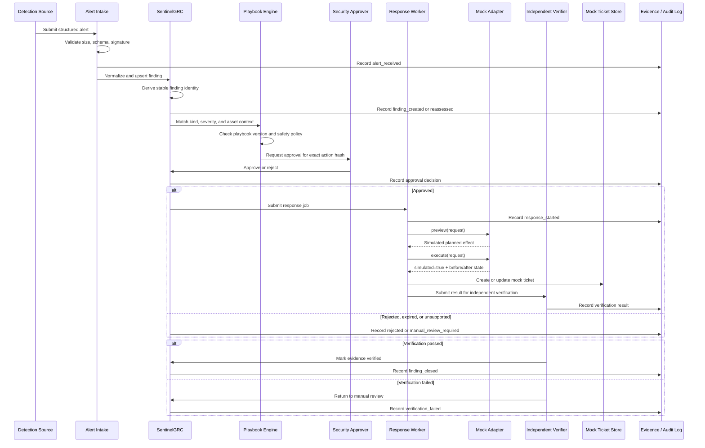
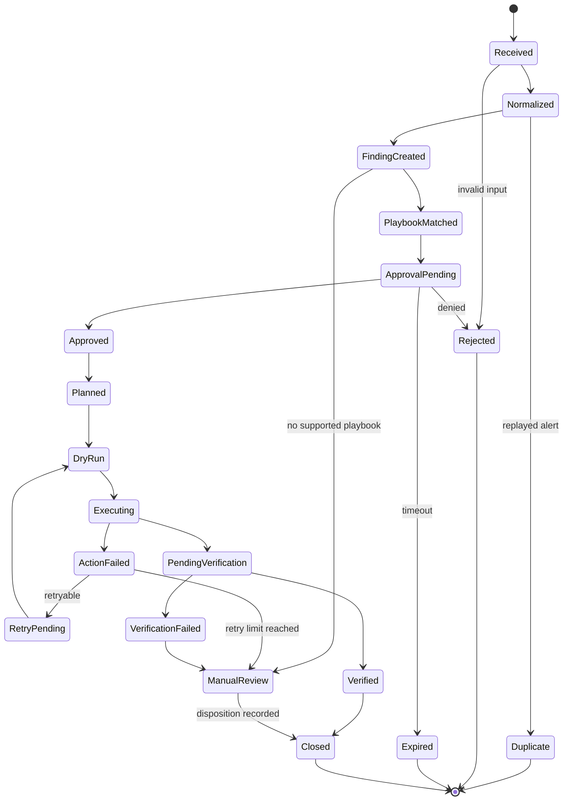
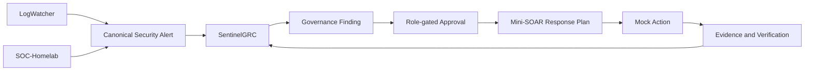

# Mini-SOAR MVP Blueprint

## Project name

# Sentinel Mini-SOAR

Concept-only security response orchestration that connects detection alerts to
governed, approval-driven, simulated response actions.

```text
Detect   = LogWatcher / SOC-Homelab alert
Govern   = SentinelGRC finding, risk, approval, evidence
Respond  = Mock action adapter
Assure   = Independent verification and audit
```

## Positioning

> An approval-driven security response orchestration platform for safe,
> auditable incident handling.

This is not an autonomous script that changes infrastructure. It demonstrates
how a SOC analyst moves from alert to response while preserving approval,
separation of duties, idempotency, verification, failure recovery, and audit.

All adapters are simulation-only. No real AD, endpoint, firewall, EDR, cloud,
SIEM, email, or ticketing system is modified.

---

# 1. MVP Scope

```text
Alert
? Normalize
? Validate
? Create Finding
? Match Playbook
? Risk / Treatment Decision
? Analyst Approval
? Build Response Plan
? Dry-run Mock Action
? Verify Simulated State
? Evidence Package
? Audit
? Close
```

## In scope

- LogWatcher and SOC-Homelab synthetic alert fixtures.
- Brute-force, privilege-escalation, and malware-like host scenarios.
- Stable finding identity and replay protection.
- Versioned playbook matching.
- Role-gated approval and separation of duties.
- Dry-run mock account, host, and ticket stores.
- Idempotent jobs with timeout, retry, cancellation, and manual review.
- Before/after simulated state and hash-linked evidence.

## Out of scope

- Real AD account disablement, host isolation, firewall, EDR, cloud, SIEM,
  Jira, ServiceNow, Slack, or email actions.
- Autonomous approval, unrestricted commands, or LLM-generated execution.
- Production credentials, enterprise SLA, or production-readiness claims.

---

# 2. Enterprise Context Diagram



---

# 3. Core Workflows

## Brute-force response

```text
LogWatcher detects Event 4625 failures
? Normalize source IP, account, asset, and severity
? Create or reassess finding
? Match PB-BF-001
? Propose mock disable-account + mock ticket actions
? Security approver reviews exact action hash
? Run MockDisableAccount in dry-run mode
? Verify synthetic account state
? Record evidence and close
```

## Privilege-escalation response

```text
Event 4672 alert arrives
? Create critical finding
? Match PB-PE-001
? Require security-manager approval
? Create mock incident ticket
? Record analyst disposition and evidence
? Verify independently
? Close or return to manual review
```

## Malware-like host isolation

```text
Synthetic malware alert identifies a workstation
? Validate asset context
? Match PB-ML-001
? Require security and asset-owner approval
? Run MockIsolateHost against synthetic asset state
? Verify network_state = isolated in mock store
? Create mock ticket and evidence package
? Close after independent verification
```

## Unknown alert

```text
Unsupported alert
? No playbook match
? Manual-review disposition
? No adapter call
? Preserve alert evidence
```

---

# 4. Detailed Sequence Diagram



---

# 5. Architecture Layers

## Detection and intake

Accept source-specific alerts only at the boundary. Validate required fields,
payload size, signature fixture, stable event identity, and
`environment = synthetic-lab`.

```json
{
  "alert_id": "ALERT-001",
  "source": "logwatcher",
  "source_event_id": "EVT-4625-001",
  "kind": "brute_force",
  "severity": "high",
  "detected_at": "2026-07-22T10:00:00Z",
  "asset_id": "WIN-DC01",
  "account": "alice",
  "source_ip": "203.0.113.45",
  "evidence_ref": "sample://logwatcher/alerts/001",
  "environment": "synthetic-lab"
}
```

## Governance and planning

Create a finding with asset, risk owner, severity, evidence, treatment,
playbook ID/version, action hash, and approval requirement. Generate a plan
before calling any adapter:

```text
Finding: SEC-ALERT-001
Playbook: PB-BF-001 v1
Action 1: mock_disable_account(account=alice)
Action 2: mock_create_ticket(type=security-incident)
Mode: dry-run
Environment: synthetic-lab
```

Alert fields can never contain executable shell, PowerShell, HTTP, or cloud
commands.

## Execution and verification

Each adapter is explicit, allowlisted, deterministic, idempotent, dry-run by
default, bounded by timeout/retry, and returns before/after state. The
verifier checks the simulated post-condition and confirms the action hash.

---

# 6. State Machine



```text
???? Execute ???? Approved
???? Execute ??? approval ??????????? action hash ???????
???? Close ???? Verification Passed ???? manual disposition
???? Replay ????????? finding/action ???
???? Unsupported alert ????? adapter
```

---

# 7. Data Model

## `security_alerts`

```text
alert_id, source, source_event_id, kind, severity, asset_id
account, source_ip, detected_at, evidence_ref, payload_hash
environment, received_at
```

## `response_findings`

```text
finding_id, alert_id, title, risk_owner, severity, status
playbook_id, playbook_version, created_at, updated_at
```

## `playbooks`

```text
playbook_id, version, trigger_kind, minimum_severity
allowed_actions, required_roles, approval_ttl_minutes
max_attempts, dry_run_default, enabled
```

## `approval_records`

```text
approval_id, finding_id, playbook_id, playbook_version
action_hash, actor_id, actor_role, decision, reason
expires_at, decided_at
```

## `response_jobs` and `action_results`

```text
job_id, finding_id, action_type, adapter_name, mode, status
attempt_count, request_hash, error_code, started_at, completed_at

result_id, job_id, simulated, before_state, after_state
postcondition, adapter_output_hash, result_status, created_at
```

## `verification_records` and `audit_events`

```text
verification_id, finding_id, verifier_id, result, checks_json, verified_at

event_id, finding_id, actor_id, actor_type, event_type, details
previous_hash, event_hash, occurred_at
```

---

# 8. Role Model

| Role | Responsibility |
|---|---|
| Detection Source | Submit structured alert |
| SOC Analyst | Triage and propose treatment |
| Risk Owner | Own asset/risk context; cannot self-approve |
| Security Approver | Approve exact response plan |
| Response Worker | Run approved mock adapter |
| Verifier | Independently verify simulated state |
| Auditor | Read-only evidence review |
| Policy Admin | Maintain versioned playbooks |

```text
Risk owner ? Security approver
Response worker ? Verifier
Playbook admin ? approver for the same change
Verifier ? closer when independent review is required
```

---

# 9. Mock Execution Design

```python
class ActionAdapter:
    def validate(self, request): ...
    def preview(self, request): ...
    def execute(self, request): ...
    def verify(self, result): ...
    def rollback(self, result): ...
```

Implement first:

```text
MockDisableAccount
MockIsolateHost
MockCreateTicket
NoOpManualReview
```

Example result:

```json
{
  "result_id": "RESULT-001",
  "adapter": "mock_disable_account",
  "simulated": true,
  "mode": "dry-run",
  "before_state": {"account": "alice", "enabled": true},
  "after_state": {"account": "alice", "enabled": false},
  "postcondition": "account_disabled_in_mock_store",
  "status": "success"
}
```

MVP supports dry-run only. A repeated action is idempotent, failed actions
cannot close findings, and adapters cannot import real control-plane clients.

---

# 10. Security Design

The MVP contains no credentials or live integration code for AD, Windows
Firewall, EDR, cloud, Elastic/SIEM, Jira, ServiceNow, Slack, or SMTP.

Input protections:

- Reject oversized or malformed payloads.
- Reject unknown action types.
- Never execute commands from alert fields.
- Derive actor identity server-side.
- Bind approval to finding, playbook version, and action hash.
- Protect against duplicate event and job execution.
- Mark every action result `simulated = true`.

Published evidence must not contain secrets, real identities, production
hostnames, absolute local paths, or runtime metadata.

---

# 11. Evidence and Ticket Integration

MVP uses local adapters:

```text
Local JSON response package
Local JSON ticket adapter
SentinelGRC governance connector boundary
```

```text
response-package/
??? alert.json
??? finding.json
??? playbook.json
??? approval.json
??? response-plan.json
??? action-result.json
??? verification.json
??? audit-events.jsonl
??? SHA256SUMS.txt
```

Relationship:

```text
Detection Alert
? SentinelGRC Finding
? Approved Treatment
? Mock Response Result
? Verification Evidence
? Governance Closure
```

Real EDR, AD, ITSM, SIEM, and cloud adapters are future design boundaries,
not MVP implementation.

---

# 12. Test Plan

## Ingestion and playbook tests

- Valid LogWatcher and SOC-Homelab alerts.
- Malformed, oversized, unsigned, duplicate, and replayed alerts.
- Unsupported alert routes to manual review.
- Brute-force, privilege-escalation, and malware playbooks match correctly.
- Disabled or old playbook versions cannot execute.

## Approval and action tests

- Unapproved, unauthorized, expired, or hash-mismatched plans cannot execute.
- Risk owner cannot approve own finding.
- Dry-run changes only synthetic state.
- Re-run is idempotent.
- Timeout retries within limit then moves to manual review.
- Unknown adapter is rejected.

## Verification and evidence tests

- Correct simulated state passes verification.
- Wrong state fails verification.
- Worker cannot verify its own action.
- Audit tampering is detected.
- Evidence hashes are reproducible.
- No secrets or absolute paths appear in published evidence.

---

# 13. MVP Definition of Done

```text
LogWatcher submits brute-force alert
? Alert validates and normalizes
? SentinelGRC creates one finding
? PB-BF-001 is selected
? Security approver approves exact plan
? MockDisableAccount runs in dry-run mode
? Synthetic account state changes
? Independent verifier confirms post-condition
? Mock ticket is updated
? Evidence and audit package are produced
? Finding closes
```

Must also prove that replay creates no duplicate action, unauthorized approval
cannot execute, expired approval cannot execute, unsupported alerts cannot call
adapters, failed actions cannot falsely close, and dry-run cannot reach real
infrastructure.

---

# 14. Repository Structure

```text
SentinelGRC/
??? README.md
??? docs/
?   ??? mini-soar-blueprint.md
?   ??? mini-soar-mvp-blueprint.md
?   ??? mini-soar-runbook.md
?   ??? mini-soar-demo-scenario.md
??? response/
?   ??? models.py
?   ??? normalize.py
?   ??? playbooks.py
?   ??? approvals.py
?   ??? planner.py
?   ??? worker.py
?   ??? adapters.py
?   ??? verifier.py
?   ??? evidence.py
??? config/response-playbooks.json
??? sample_data/
?   ??? brute-force-alert.json
?   ??? privilege-escalation-alert.json
?   ??? malware-alert.json
??? test_*.py
```

No live endpoint adapter belongs in this MVP repository.

---

# 15. Build Order

1. Define alert, finding, playbook, approval, job, and evidence schemas.
2. Define the response state machine.
3. Add LogWatcher and SOC-Homelab normalizers.
4. Add replay-safe finding identity.
5. Define versioned playbook policy.
6. Implement approval and separation-of-duties checks.
7. Implement response plan generator.
8. Implement synthetic identity and asset stores.
9. Implement mock action adapters.
10. Add dry-run, timeout, retry, cancellation, and verification.
11. Add local JSON ticket adapter and evidence package.
12. Add brute-force end-to-end scenario.
13. Add privilege-escalation and malware-like scenarios.
14. Add failure, security, and evidence tests.
15. Add sanitized screenshots and demo runbook.
16. Add SentinelGRC connector boundary and portfolio release tag.

---

# 16. SentinelGRC Integration



```text
LogWatcher / SOC-Homelab
= Detection Layer

SentinelGRC
= Governance, ownership, approval, evidence, and closure

Mini-SOAR
= Concept-only response orchestration using mock adapters
```

## Summary

```text
Detection
? Governance Finding
? Risk and Treatment Decision
? Human Approval
? Safe Simulated Response
? Independent Verification
? Auditable Closure
```
