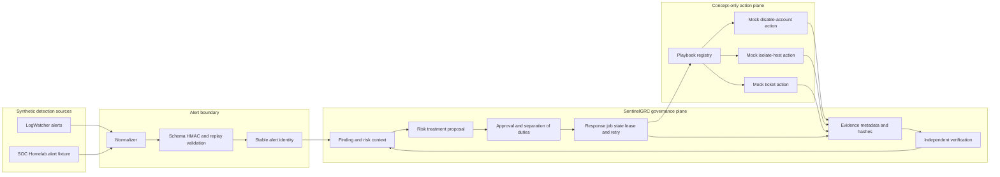
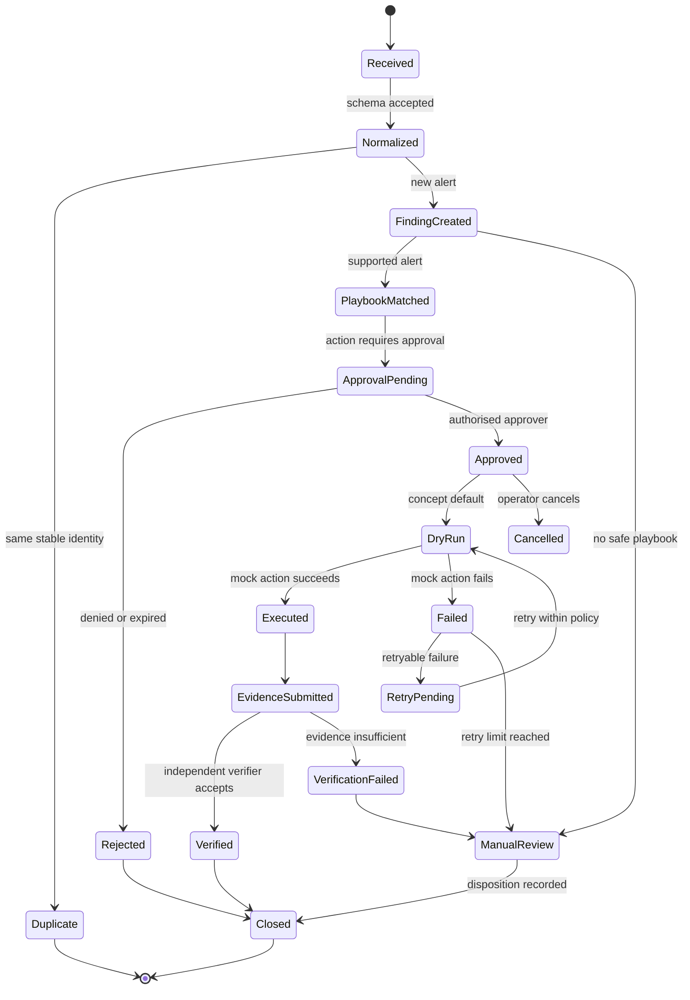
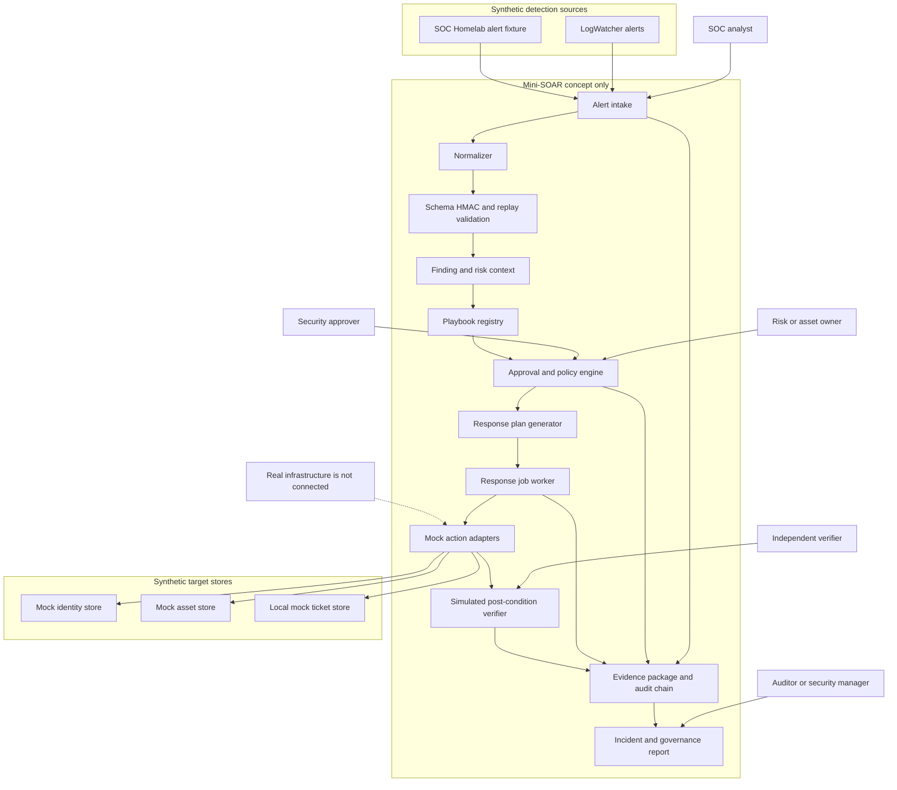
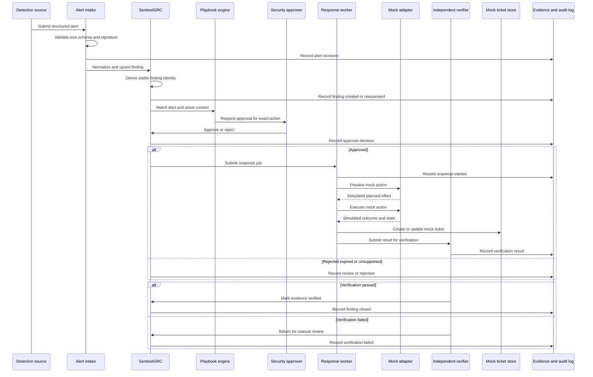
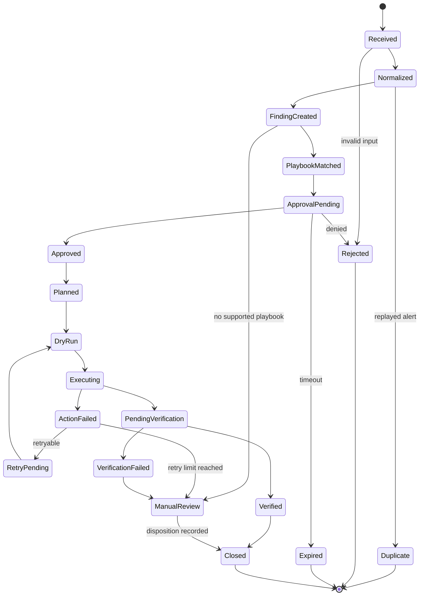
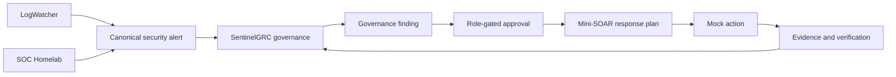

# Historical Mini-SOAR integration diagrams

Design reference only, not a SentinelGRC runtime feature or validated live integration.

### Mini-SOAR blueprint appendix

The next six diagrams are the remaining Mermaid diagrams from the Mini-SOAR design documents. They describe a **separate concept-only response layer** that can feed evidence back into SentinelGRC. They do not represent an implemented live response service in this repository: all action adapters and target stores below are synthetic or mock by design.

#### Mini-SOAR concept architecture

This diagram shows the proposed boundary from synthetic detections through approval, mock response actions, evidence, and re-verification. The SentinelGRC governance plane remains the system of record for the finding and its decision trail.

#### Mini-SOAR concise lifecycle

This is the short response-lifecycle view. It shows that an unsupported alert, rejected approval, failure, or insufficient verification is deliberately routed to review rather than allowing an unrestricted action.

#### Mini-SOAR enterprise context

This diagram adds the human roles and synthetic target stores around the proposed response plane. It is useful for explaining separation of duties, but the `Mock` stores are not Active Directory, EDR, a ticketing platform, or a real asset inventory.

#### Mini-SOAR detailed sequence

This sequence expands the proposed action path. It is intentionally labelled `Mock Adapter` and `Mock Ticket Store`: it documents an evidence-producing lab scenario, not a command path to real systems.

#### Mini-SOAR detailed state machine

This version makes validation failure, approval expiry, planning, execution, retry, and manual review explicit. It is a design contract for the proposed Mini-SOAR workflow; it is not the SentinelGRC finding state machine shown earlier.

#### SentinelGRC and Mini-SOAR integration map

This final design diagram states the intended responsibilities: detection sources produce a canonical alert, SentinelGRC governs the finding and approval, and Mini-SOAR can only run a mock response plan before evidence is returned to SentinelGRC.

In short: LogWatcher and SOC-Homelab are detection concepts, SentinelGRC is the governance and evidence sink, and Mini-SOAR remains a proposed mock-response concept. No diagram in this section authorises a real identity, endpoint, network, cloud, or ticketing action.
