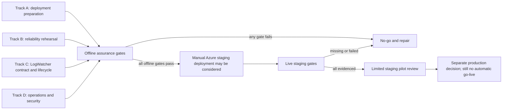
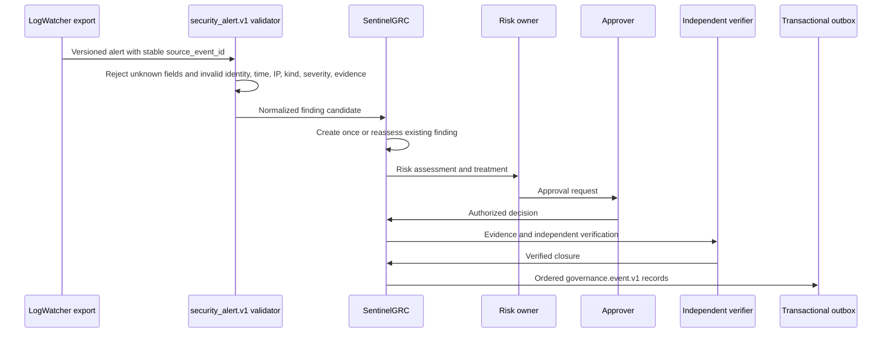

# SentinelGRC staging assurance plan

## Scope

This package prepares SentinelGRC for a controlled Azure staging trial without
contacting Azure. It does not deploy infrastructure, validate a tenant, prove
Managed Identity, or authorize production. The offline result can be
`READY_FOR_MANUAL_AZURE_STAGING`; production remains `NO_GO` until live gates
are evidenced and separately approved.



## Track A: deployment preparation

The authoritative deployment procedure remains
[`azure-staging-deployment.md`](azure-staging-deployment.md). The assurance
policy in `config/staging-assurance.example.json` adds deterministic offline
gates and live acceptance gates. It contains thresholds and identifiers only;
credentials, connection strings, tokens, passwords, and client secrets are
rejected.

Run the existing Azure input preflight without mutation:

```powershell
.\scripts\Test-AzureStagingInputs.ps1 `
  -ContainerImage "example.azurecr.io/sentinelgrc@sha256:<64-hex-digest>" `
  -RegistrySubscriptionId "<subscription-guid>" `
  -RegistryResourceGroup "<resource-group>" `
  -RegistryName "<registry-name>" `
  -OidcIssuer "https://login.microsoftonline.com/<tenant-guid>/v2.0" `
  -OidcAudience "<application-guid>" `
  -OidcTenantId "<tenant-guid>" `
  -OidcJwksUrl "https://login.microsoftonline.com/<tenant-guid>/discovery/v2.0/keys"
```

For the Entra v2 deployment path, `OidcAudience` is the bare application client
ID GUID verified against the token `aud` claim. Managed-identity clients still
request `api://<application-guid>/.default`; the request scope and verified
claim value are separate parts of the contract.

Run the repository-only staging package:

```powershell
python -m scripts.staging_assurance `
  --policy config/staging-assurance.example.json `
  --alerts docs/evidence/staging-readiness/logwatcher-security-alert.v1.jsonl `
  --output runtime/staging-assurance/offline-report.json
```

The command exits non-zero if an offline gate fails. It constructs no Azure
client. Expected decisions before a live trial are:

```text
offline_decision: READY_FOR_MANUAL_AZURE_STAGING
live_validation.decision: NO_GO
production_decision: NO_GO
azure_mutation_performed: false
```

### Deployment and rollback checklist

- [ ] Source commit and image digest match the reviewed change record.
- [ ] Bicep compiles from a read-only repository mount.
- [ ] `what-if` is reviewed by the resource owner before mutation.
- [ ] Cost owner, region, resource group, and budget alert are approved.
- [ ] Infrastructure is deployed with `deployApplication = false` first.
- [ ] Private DNS, private endpoints, Key Vault references, and RBAC are checked.
- [ ] The application revision is enabled only after infrastructure validation.
- [ ] The last-known-good Container Apps revision is recorded.
- [ ] Database migrations are forward-only; rollback uses restore to a new server.
- [ ] Evidence retention is reviewed before resource deletion or revision rollback.

## Track B: reliability and recovery

Repository tests exercise deterministic local versions of the failure paths.
They prove state-machine behavior, not Azure availability.

| Scenario | Expected invariant | Repository evidence | Live evidence still required |
|---|---|---|---|
| Worker crashes after broker acceptance | Stable message identity; replay does not create a second logical message | `test_crash_after_publish_replays_same_identity_without_duplicate` | Kill the real sidecar after send and inspect the session-aware consumer |
| Publisher unavailable | Record remains pending/retrying and is never acknowledged | `test_publisher_interruption_never_acknowledges_and_then_recovers` | Block Service Bus access and observe retry/alert/recovery |
| Database unavailable | No publish or acknowledgement occurs without a fenced claim | `test_database_claim_failure_cannot_publish_or_acknowledge` | Interrupt PostgreSQL connectivity and verify supervisor behavior |
| Poison payload | Permanent validation failure enters dead state without repeated sends | `test_invalid_payload_is_dead_lettered_without_retry` | Inject an approved synthetic invalid record and rehearse recovery |
| Stale worker | Lease token prevents a stale worker from acknowledging reclaimed work | `test_fencing_ordering_retry_dead_letter_and_exact_requeue` | Restart sidecar during a held claim |
| Duplicate alert | Same source identity reassesses one finding | `test_canonical_contract_is_strict_and_replay_safe` | Replay the same Service Bus message and inspect downstream idempotency |
| Per-finding ordering | Later events wait for the prior undelivered sequence | `test_fencing_ordering_retry_dead_letter_and_exact_requeue` | Verify Service Bus SessionId ordering |

Recovery must never edit database rows manually. A reviewed dead outbox item is
requeued only with exact confirmation:

```powershell
python outbox_worker.py `
  --requeue-outbox "<32-character-outbox-id>" `
  --confirm "REQUEUE OUTBOX <32-character-outbox-id>"
```

## Track C: first product integration

`security_alert.v1` is the canonical boundary for the first LogWatcher staging
integration. The JSON schema is
`schemas/security-alert.v1.schema.json`; runtime validation is implemented in
`security_alert_contract.py`.



Stable finding identity is derived from contract version, source,
`source_event_id`, asset, and kind. Mutable title or severity can change during
reassessment without creating a duplicate finding. Caller-supplied approval or
actor fields are unknown fields and fail validation.

The tracked fixture is synthetic and sanitized:

```powershell
python -m scripts.staging_logwatcher `
  --events docs/evidence/staging-readiness/logwatcher-security-alert.v1.jsonl `
  --input-kind contract `
  --governance-db runtime/staging-contract.db
```

Run the command twice. The first run must create three findings; replay must
create zero and reassess three. This does not prove a live Windows, Elastic, or
Service Bus source.

## Track D: operations and security

### Threat model

| Threat | Implemented boundary | Evidence to retain | Azure-stage unknown |
|---|---|---|---|
| Forged or ambiguous alert | Strict version, required fields, event-kind mapping, timezone, IP, evidence-reference and unknown-field validation | Rejected fixture and test output | Real source authentication and transport path |
| Duplicate/replayed alert | Server-derived stable finding ID and idempotent upsert | First/replay report and finding IDs | Downstream Service Bus consumer idempotency |
| Caller impersonates approver | Governance actors come from authenticated server context | Separation-of-duties tests and audit events | Entra role/group assignment correctness |
| Message tampering | Canonical JSON, metadata match, SHA-256 property, stable MessageId | Outbox payload and integrity tests | Broker and consumer-side verification |
| Stale or competing worker | Lease token, worker ID, expiry fencing and ordered claims | Fencing/reclaim tests | Sidecar restart and scale-out behavior |
| Shared-key credential theft | Managed Identity only; local/shared-key fallback rejected | Configuration and IaC tests | Actual RBAC scope and identity assignment |
| Evidence deletion or overwrite | Create-only content-addressed evidence and audit adapters | Integrity/replay tests | Locked retention, restore, legal hold |
| Private-service exposure | IaC disables public access and declares private endpoints | Bicep policy/compile result | Tenant deployment and DNS validation |
| Secret leakage in logs/repo | Redaction, secret scan, identifier-only examples | CI hygiene and review evidence | Azure diagnostic settings and operator practice |

### Monitoring and alert contract

| Signal | Default threshold | Severity | Required operator response |
|---|---:|---|---|
| Outbox worker heartbeat age | greater than 120 seconds | High | Check sidecar revision, identity and database connectivity |
| Oldest pending outbox age | greater than 300 seconds | High | Check Service Bus reachability and ordered blocking item |
| Retrying outbox count | greater than 0 | Medium | Inspect sanitized error class and recovery trend |
| Dead outbox count | greater than 0 | Critical | Stop release progression; review payload and exact requeue |
| API readiness | non-200 for 2 consecutive probes | High | Check configuration, PostgreSQL and worker health |
| OIDC verification failures | sustained increase above baseline | High | Check issuer/JWKS/role mapping and possible abuse |
| Evidence or audit integrity failure | any occurrence | Critical | Preserve state, stop closure/export, begin incident review |
| Contract rejection rate | sustained increase above baseline | Medium | Compare source version and rejected-field reason |

Thresholds are release defaults, not universal production SLOs. They must be
tuned using staging measurements and documented approval.

### Incident runbooks

1. **Database unavailable:** readiness must fail; do not publish unclaimed
   messages. Restore connectivity, confirm migrations/checksums, then observe
   fenced recovery.
2. **Service Bus unavailable:** keep PostgreSQL authoritative. Observe retry
   count and lag; do not bypass Managed Identity with a connection string.
3. **Dead outbox item:** preserve the payload hash and error, stop release
   progression, correct the cause, obtain approval, and use exact requeue.
4. **Worker stale:** confirm only one intended sidecar configuration, inspect
   heartbeat and lease age, restart the revision, then prove stale acknowledgement
   is rejected.
5. **Alert-contract rejection:** retain a sanitized rejected sample and reason;
   fix the source adapter or version contract rather than accepting unknown fields.
6. **Integrity failure:** stop verification/closure and exports, preserve the
   database and object versions, validate the event chain, and escalate to the
   security owner.
7. **Rollback:** activate the recorded last-known-good application revision.
   Never delete migration files or downgrade schema in place. Restore PostgreSQL
   into a new server and use an approved cutover when data rollback is required.

## Go/no-go evidence

The offline report is necessary but not sufficient. A limited staging pilot is
eligible for human review only when every key in `required_live_gates` has a
boolean `true` in a separately retained evidence file. Unknown, missing, string,
or false values produce `NO_GO`.

Required live evidence includes Managed Identity authentication, private
network validation, Service Bus delivery, sidecar restart recovery, dead-letter
recovery, backup restore, observed monitoring alerts, and rollback rehearsal.
Store screenshots, command output, resource IDs, timestamps, operator/reviewer
identity and hashes in an approved private evidence location—not this public
repository.

Even when every live staging gate passes, the evaluator returns only
`GO_LIMITED_STAGING_PILOT`. Production remains a separate organisational risk
decision requiring security assessment, capacity/SLO validation, data
classification, support ownership, incident response, DR and change approval.

## Deterministic offline evidence collector

After the offline assurance path passes, create a sanitized, hash-verifiable
evidence envelope without contacting Azure:

```powershell
python -m scripts.collect_offline_evidence `
  --source-commit <reviewed-40-character-commit-sha>
```

The fixed output is
`runtime/staging-assurance/offline-evidence.json`. The collector records only
the reviewed source commit, canonical policy and alert hashes, bounded result
counts, offline gate booleans, and an explicit claim boundary. It excludes raw
alerts, finding IDs, resource identifiers, endpoints, credentials, and live
evidence.

Exit code `0` means the repository-only offline gates passed. Exit code `1`
means one or more offline gates failed but a valid evidence envelope was still
written. Exit code `2` means input, path, schema, sanitization, or output
validation failed. Every result keeps `current_live_gate_credit` false and
`production_decision` equal to `NO_GO_PENDING_LIVE_EVIDENCE`.


### Cross-platform output identity

The collector reports the fixed logical output identity
`runtime/staging-assurance/offline-evidence.json` after the confined write
succeeds. It does not derive that identity from host-specific canonical path
spellings, including Windows 8.3 aliases, so the same successful write cannot
be misclassified as a validation failure on a different runner.